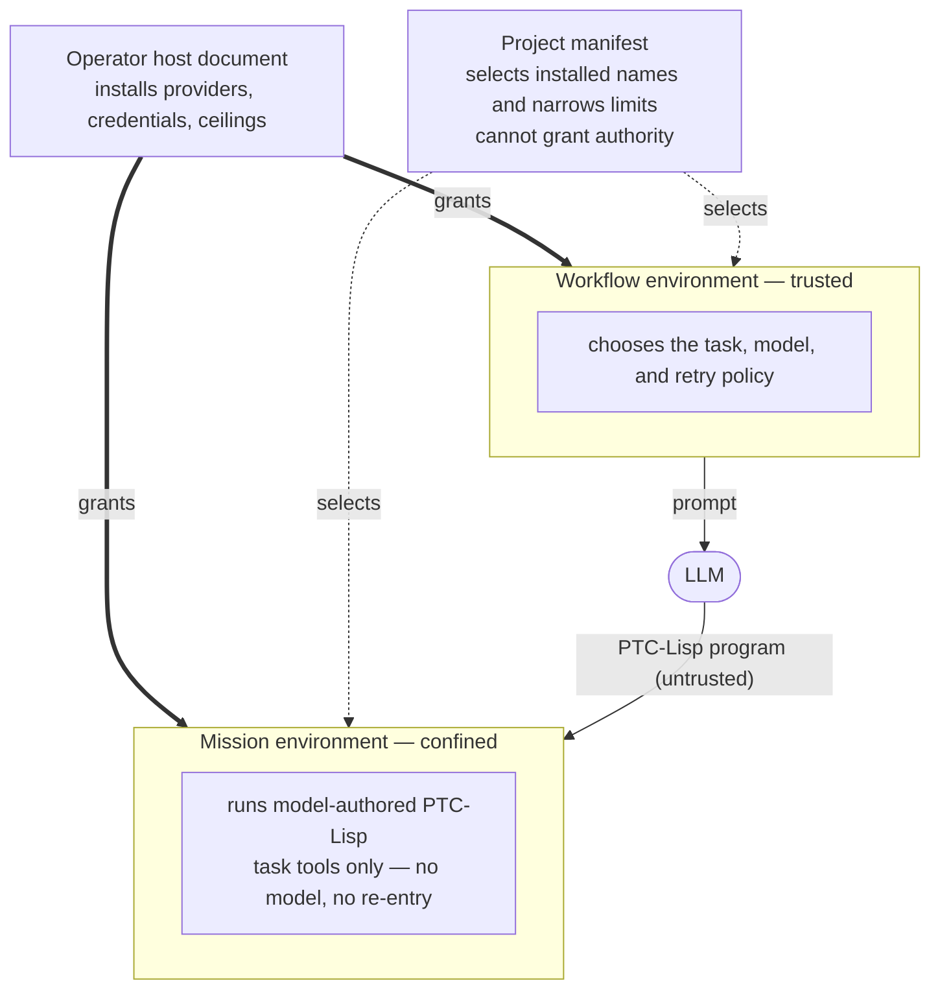

# PtcRunner

PtcRunner lets an LLM write a small program to solve a task, then runs that
program with only the tools you allow.

This pattern is often called **code mode**: instead of relaying one tool call at
a time through the model, the model writes code that calls several tools,
transforms their results, branches, and loops. That cuts round trips and keeps
intermediate data out of the context window. The usual catch is that you are now
executing model-written code.

PtcRunner's answer is that the code is written in a language that cannot do
anything dangerous in the first place.

> PtcRunner is a 0.x project under active development. Breaking changes are
> expected.

## Try it

From the repository root:

```console
mix deps.get
mix ptc init hello-ptc
mix ptc run hello-ptc/ptc-project.json
```

```json
{}
```

The generated project is provider-free: it runs immediately, records a trace,
and remembers its Viewer settings. See
[Project configuration](docs/guides/project-configuration.md) for the
single-file workflow, or [Quickstart](docs/guides/quickstart.md) to get a model
writing the program.

## Why it is safe

Most code-mode implementations generate Python or JavaScript and put a container
or microVM around it, because those languages can do anything and the sandbox
has to take it all back. PtcRunner inverts that: the boundary is the language
and the capability grant, and a container is optional defense in depth rather
than the thing holding the line.



Authority flows one way: the operator grants it, the project may only select
and narrow it, and generated code runs in the environment that was given the
least. The mission returns a bounded value to the workflow, which decides
whether to continue.

- **The language has no escape hatches.** PTC-Lisp is a small, eager subset of
  Clojure. There is no `eval`, no macros, no host interop, no lazy or infinite
  sequences, and no ambient filesystem, network, or process access. Generated
  code cannot reach anything that was not handed to it.
- **Model-written code runs with less authority than the code that called it.**
  A run has two environments. The trusted *workflow* may call a model; the
  *mission* that executes generated code gets only the narrow task tools the
  host installed and the manifest selected. Mission code cannot call the model
  capability and cannot re-enter the evaluation boundary.
- **Applications cannot grant themselves authority.** A project's JSON manifest
  selects installed provider names and may narrow them. It cannot name an
  executable, endpoint, credential, or host callback, or raise a ceiling. Only
  the separate operator-owned host document installs those.
- **External tools arrive through exactly one door.** MCP is the only way to
  give a project a tool — there is no plugin API and no code to register. The
  runtime pins the final `2026-07-28` protocol, speaks it over stdio or
  streamable HTTP, and maps each upstream tool to a public name and read/write
  effect the operator chooses. A manifest selecting a write-bearing
  installation must explicitly allow its chosen tools; it supplies no
  connection details and no credentials. Streamable HTTP supports
  credential-free, static-authentication, and explicit principal-scoped OAuth
  installations; authorization completes before a run and never causes an
  automatic tool-call replay.
- **Every run is bounded, and enforced rather than requested.** Deadlines, heap,
  tool-call counts, result sizes, and event budgets are held by the runtime.
  The BEAM gives each evaluation its own heap and monitors, so a limit breach
  kills the evaluation and cleans up its resources instead of being politely
  asked to stop.

Because isolation is a BEAM process rather than an OS process, it is cheap
enough to do for every evaluation.

Treat the workflow bundle and manifest as your application code. Treat
model-generated source, tool output, and file content as untrusted data.

## How it works

```text
task
  -> workflow: choose the prompt and retry policy
  -> model: write one PTC-Lisp program
  -> mission: run it with the allowed task tools
  -> result, usage, and trace
```

A project is some PTC-Lisp files plus a small JSON manifest naming the entry
function, input, providers, and limits. The runtime owns credentials, tool
implementations, timeouts, memory limits, and cleanup.

Three JSON documents keep those responsibilities separate:

| File | Owner | Purpose |
| --- | --- | --- |
| `ptc.json` | Application author or model | Workflow, components, input, provider selections, and narrower limits |
| `ptc-host.json` | Operator | Installed providers, credential references, commands, endpoints, and outer limits |
| `ptc-project.json` | Operator or project checkout | Stable paths, local artifact policy, and Viewer preferences |

A failed program is useful rather than fatal: definitions from successful turns
stay available, failed attempts roll back cleanly, and the model gets a bounded
correction message instead of a stack trace.

## Swap the agent loop

The shipped loop is ordinary PTC-Lisp rather than fixed runtime behavior. After
the first model run, [Building agents](docs/guides/building-agents.md) shows how
to use it, separate workflow and mission authority, and replace prompt policy
without changing the trusted host.

## See what happened

Every run emits structured events: outcomes, errors, tool use, evaluations,
limits, and resource use. They deliberately contain no prompts, model responses,
tool payloads, or generated source.

Analyzing them is itself a bounded run. The shipped `analysis` prelude exposes
three navigation operations—`runs`, `open`, and `read`—over one frozen evidence
capture. `read` pages the public `activity` collection or, with explicit private
authority, collections such as reconstructed turns, model exchanges, generated
source, and execution errors. Neither analysis profile gains filesystem,
network, model, or nested-evaluation authority.

When you need the exact prompt and the exact generated code, that is a separate
opt-in artifact written with owner-only permissions, kept out of normal trace
discovery, and never joined into ordinary query results. `ptc viewer
PROJECT.json` opens a local, loopback-bound, read-only web UI for browsing
those runs.

## Evaluate a change

Two pieces make it possible to test a change to agent behavior instead of
guessing:

- **Candidate components.** A trusted host step can compile one already-selected
  component from replacement source, verifying both the hash of the candidate
  and the hash of the base it was derived from before anything reaches the
  compiler. A manifest cannot request one and a generated program cannot observe
  one.
- **A frozen model.** A replay provider serves recorded responses keyed by a
  hash of the provider-neutral request, so a behavioural difference between a
  baseline run and a candidate run is attributable to the candidate rather than
  to model drift. It is selected by the same manifest grammar as a live model,
  so nothing about the application changes between them.

Promotion stays an explicit human decision today; turning trace evidence into
promoted preludes automatically is future work. The important property holds
either way: a candidate can change how existing tools are used, but cannot grant
itself new tools or credentials.

## Availability

The product runs from a source checkout with Elixir and Mix or as a locally
built runtime-included release. The release does not need Erlang or Elixir on
the target machine.

| Installation | Status | Interface |
| --- | --- | --- |
| Source checkout with Mix | Available | `mix ptc run`, `mix ptc repl` |
| Hex dependency for Elixir applications | Next 0.x release | Mix tasks and `PtcRunner.Kernel` |
| Local runtime-included release | Available from source | `_build/prod/rel/ptc_runner/bin/ptc` |
| Signed packages and container images | Planned | The same `ptc` command and runtime contract |

## Guides

Read these in order. Each one owns its topic and links onward.

1. [Quickstart](docs/guides/quickstart.md) — the shortest path from a clone to a
   live model writing and running a program.
2. [Getting started](docs/guides/getting-started.md) — inspect the generated
   files, run a data workflow, and read its result, trace, and REPL state.
3. [Building agents](docs/guides/building-agents.md) — start with the shipped
   loop, then separate workflow and mission authority and replace prompt policy.
4. [Connecting tools with MCP](docs/guides/connecting-tools-with-mcp.md) — map
   external tools into narrow model-visible capabilities.
5. [Manifests and capabilities](docs/guides/manifests-and-capabilities.md) —
   assemble components, data, providers, limits, contracts, and event policy.
6. [Host configuration](docs/guides/host-configuration.md) — install provider
   aliases, credentials, data classes, and outer policy.
7. [Running and debugging](docs/guides/running-and-debugging.md) — the
   commands, results, traces, private inspection, and the Viewer.
8. [Debug a failed run](docs/guides/debugging-a-failed-run.md) — navigate one
   immutable failed capture from another PTC run, through typed evidence links.
9. [Evaluate changes with replay](docs/guides/evaluating-with-replay.md) — hold
   model responses fixed while testing candidate component source.

### Going further

- [Kernel REPL](docs/guides/kernel-repl.md) — complete interactive session
  modes, JSON Lines output, and private inspection analysis.
- [Components and preludes](docs/guides/components-and-preludes.md) —
  namespaces, dependencies, exports, signatures, and tool requirements for
  reusable PTC-Lisp libraries.
- [Agent library reference](docs/agent-library-reference.md) — exact entry
  functions, options, turn protocol, feedback, and retry rules for the shipped
  `agent.core` and `agent.main` libraries.
- [Embedding in Elixir](docs/guides/embedding-in-elixir.md) — drive the same
  Kernel directly from a host application instead of the command line.

### Examples

Runnable projects live under
[`examples/kernel-tutorial/`](https://github.com/andreasronge/ptc_runner/tree/main/examples/kernel-tutorial),
[`examples/kernel-inspection-lab/`](https://github.com/andreasronge/ptc_runner/tree/main/examples/kernel-inspection-lab),
and
[`examples/named-mission-reader-writer/`](https://github.com/andreasronge/ptc_runner/tree/main/examples/named-mission-reader-writer).

### Reference

[PTC-Lisp specification](docs/ptc-lisp-specification.md),
[function reference](docs/function-reference.md),
[shipped prelude reference](docs/prelude-reference.md),
[signature syntax](docs/signature-syntax.md),
[Kernel limits](docs/kernel-limits-reference.md),
[TraceLog contract](docs/trace-log-contract.md), and the
[conformance report](docs/conformance/index.md).

### Maintainers

For changing PtcRunner rather than using it:
[Kernel maintainer guide](docs/guides/kernel-maintainer.md),
[coding agent review workflow](docs/guides/coding-agent-review-workflow.md),
[duplication gate](docs/guides/duplication-gate.md), and
[documentation guidelines](docs/guides/documentation-guidelines.md).

## Development

```console
mise install
mix deps.get
(cd ptc_viewer && mix deps.get)
(cd ptc_runner_launcher && mix deps.get)
mix precommit
git push
```

Install hooks once per clone with `./scripts/install-hooks.sh`; linked
worktrees share them. The tracked pre-push hook runs the complete push gate,
using the same repository-owned scripts as GitHub Actions, and validates
documentation before longer stages. Run `mix prepush` directly only to diagnose
its static and Dialyzer scripts or when hooks are unavailable. The core test
script sets `CI=1` while retaining the project's scheduler-count ExUnit
concurrency, so property and load-sensitive failures remain visible locally.

## License

See [LICENSE](LICENSE).
