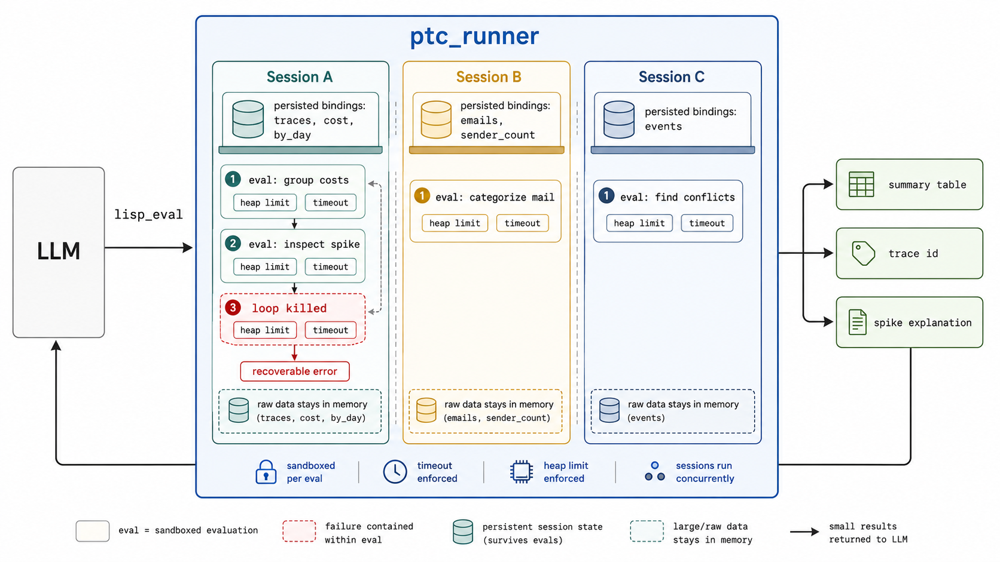

# The Right Tool for Code Mode

---

A while back I built my own personal assistant and wired it to my email, calendar, and phone over MCP. One of the first things I asked it to do was show me the last 10 emails.

That was already enough to feel the problem. Email bodies are long, quoted threads are longer, and every message the tool returned was now sitting in the model's context. The model had not done any real work yet. It had just fetched data, and the context window was already being spent.

Then I asked for something more useful. Go through my mail, suggest a few categories, and give me some statistics. This was ordinary data work: grouping, counting, comparing. But the model tried to do it by reading messages one at a time in its head. The context filled up, the answers got vague, and the counts were wrong.

Some of that was on my Gmail MCP. But the failure pointed at something deeper. The model was being asked to *be the computer*, and it is not good at that. It is good at deciding *what* to compute. Those are different jobs, and I had handed it the wrong one.

That failure is the reason I built the agentic framework [ptc_runner](https://github.com/andreasronge/ptc_runner), and lately a standalone MCP server on top of it. I wanted the model to stop doing computation in its head and instead write small programs. 

This post is about why I think code mode needs a smaller execution language than Python or JavaScript. Along the way it changed how I design tools, which is the part I keep coming back to.

## Code mode is having a moment

The idea going around is a good one. Instead of the model calling tools one at a time and dragging every result back into the conversation, it writes a small program. The program calls the tools, processes the results where they sit, and returns only the part that matters.

Cloudflare shipped this as [Code Mode](https://blog.cloudflare.com/code-mode/), turning MCP tools into a TypeScript API the model can write against. Anthropic made a similar case in [Code execution with MCP](https://www.anthropic.com/engineering/code-execution-with-mcp): keep intermediate results in the execution environment and return only the chosen value. Different languages, same move. Stop making the model the runtime. Let it write code instead.

I have been convinced by that direction for a while. Where I part ways is the next decision. *Which language should the model use?*

Code mode hides two choices inside one feature. One is the sandbox. Where does generated code run, and how cheaply can it be limited and thrown away? The other is the language surface. What is the model allowed to write inside that sandbox?

Most systems start with a familiar general-purpose language, usually Python or JavaScript, and then constrain it from the outside. ptc_runner goes the other way. The language is small enough that it removes whole categories of behavior before the sandbox has to.

## This job needs a different kind of language

Think about what the code actually is in this setting. It is short. It is thrown away the moment it runs. It was written by something that cannot be fully trusted, and it executes on your machine or in your account. When it goes wrong, what you need most is a clear signal back so the model can fix itself on the next attempt.

That is a narrow job. You need to run many small, disposable, untrusted snippets, safely, with feedback good enough to recover from. Python and JavaScript were not designed for that. They were designed for people writing programs they intend to keep. They bring their whole surface area along, including imports, file access, network calls, a vast standard library, and a thousand ways to do almost anything.

When the author is an LLM, all of that reach turns into something you have to manage. You can make it safe. People do it every day, with containers, V8 isolates, and hardened interpreters that strip capabilities back out. But look at what that work is. It lives outside the language. You pick a tool that can do anything, then spend real engineering making sure it cannot. The constraint you actually wanted is not part of the tool. It is bolted on, which means you own it, and you have to keep owning it.

The real cost of a general-purpose language here is the ongoing work of removing power you never wanted in the first place.

There is a quieter cost too. A big language gives the model a big space to be subtly wrong in. It can write something that parses fine and still means the wrong thing. For one-shot generation that has to run untrusted, that surface is working against you.

## Make the language the sandbox

ptc_runner did not start with PTC-Lisp. The first version used a tiny JSON-shaped language because it was easy to describe with a schema. It worked for simple calls, but the schema grew, the language stayed awkward, and it never felt like a real workspace.

PTC-Lisp is the version that stuck. I wanted a syntax that was small, regular, compact in tokens, and natural to use in a REPL. There is no filesystem access, no network access, no `import`, no `eval`. Those capabilities are not switched off behind a flag. They simply do not exist, so there is nothing to sandbox away. The constraint is not a wrapper around the language. It is the language.

The obvious objection is training data. Models have seen far more Python and JavaScript than a Clojure-like subset. In practice that seems to matter less than expected. The prompt does not teach a new language from scratch. It tells the model to write Clojure-like code with a small set of missing features. Even cheaper models perform reliably in a small [PTC-Lisp generation benchmark](https://github.com/andreasronge/ptc_runner/blob/main/docs/benchmark-eval.md).

Every program runs in its own lightweight BEAM process (the runtime behind Erlang and Elixir) with a wall-clock limit and a memory limit. If a program loops or balloons, that one process is killed and the model is told why, in terms it can act on. Errors are written to be recovered from, not to look like a stack trace. The model reads the feedback, adjusts, and tries again, the way you would at a REPL.

The core path through the MCP server is a single tool, `lisp_eval`, that takes a PTC-Lisp program and optional input. Sessions and diagnostics add a few more tools when you want them. Any MCP client can point at it, whether it is a desktop app, a code editor agent, or a server-side agent runtime. You run a binary and add it to the client config; you do not write Elixir or host a Python runtime. The fact that there is a 30-year-old battle-tested VM doing the isolation underneath is an implementation detail you never have to touch.

## A small example

Let me show the failure that made this concrete, and then the fix.

I set up an upstream MCP server I will call `observatory`, holding mock observability traces. It exposes three plain read tools: `list_traces`, `get_trace`, and `get_trace_steps`. I connected Claude Code straight to it and asked it to find the org-acme production spend spike.

It pulled the traces into context, read through them, and gave me an answer with a percentage in it. The percentage was wrong.

I want to be careful here, because it would be easy to dress this up. This was mock data and a single recorded run, not a benchmark. I am not claiming a precise win rate. What struck me was how *ordinary* the question was and how *easily* it went wrong. This was the very first thing I asked, not some adversarial edge case. The model was not lying. It was doing mental arithmetic over a table it had to read, and it slipped, exactly the way I would if you asked me to sum a column by eye.

Then I asked the same question through ptc_runner's code mode. The first thing the model did was not fetch every trace. It explored the tool surface from inside the Lisp session:

```clojure
(tool/servers)
(dir 'observatory {:limit 20})
(doc 'observatory/list_traces)
```

Then it made one small call to learn the result shape before writing the real logic:

```clojure
(let [r (tool/call {:server "observatory"
                        :tool "list_traces"
                        :args {:org-id "org-acme"
                               :environment "production"
                               :limit 5}})]
  {:keys (keys (:value r))
   :first (first (get (:value r) "traces"))})
```

The probe taught it the important details. The response had a `traces` array and a `next_cursor`, the records used string keys, and `total_cost` came back as a string. From there it wrote a small pagination helper, stored the traces in the session, and computed the daily totals.

```clojure
(def acme-prod
  (fetch-all {:org-id "org-acme"
              :environment "production"
              :limit 100}))

(defn cost [t] (Double/parseDouble (get t "total_cost")))
(defn day  [t] (subs (get t "started_at") 0 10))

(reduce (fn [m t]
          (assoc m (day t) (+ (get m (day t) 0.0) (cost t))))
        {}
        acme-prod)
```

The runner's feedback made the statefulness visible.

```text
[stored: acme-prod, fetch-all; turn upstream calls: 1]
```

After that, the model aggregated by day and filtered the spike locally from `acme-prod`, with no further upstream call. May 18 was the outlier. It drilled into the expensive trace with `get_trace_steps` and found a repeated loop that explained the extra cost. Nothing about this depended on a special observability tool. The answer fell out of a few small programs over primitive tools, not a specialized "find spend spike" endpoint.

The sum was computed, not estimated, so the answer was right. The raw traces stayed inside the sandbox. The model saw the probe, the aggregate, and the final explanation, not every row that led there.

The saved tokens matter, but the habit matters more. The model searched the tools, probed one call, named the result, and reused it. Nobody told it to work that way.

## Code mode should feel like a REPL

The loop is familiar from REPLs, notebooks, and shell sessions. `*1` for the last result, `def` to name something, `dir` and `doc` to look around. Give a model those and you are reusing fluency it already has. A bespoke `catalog/find` / `catalog/get` surface would have to be explained in the prompt. The model has no prior feel for it. With REPL-shaped discovery, it can inspect your tools one step at a time instead of being handed the whole catalog up front.

The first payoff is state. Investigations are naturally stateful. You bind `acme-prod`, compute the daily totals, inspect the spike, and then ask the next question against the same small workspace. If every call is a fresh sandbox, the model rebuilds that workspace over and over, or pushes it back into context. With a general-purpose runtime, keeping that workspace alive also means keeping imports, heaps, event loops, and capabilities alive. ptc_runner sessions are deliberately smaller. Definitions persist across calls, but each eval still runs with heap and timeout limits. The model gets continuity without owning a long-lived process, and a workspace that lives outside the context window.[^perf]



Discovery is the other payoff, and it starts before the first tool call. MCP tool lists get large fast, with names, descriptions, schemas, and response shapes. Most of that is irrelevant to the task in front of you.

So the model can ask for the catalog one step at a time with `(apropos "calendar")`, `(dir 'calendar)`, and `(doc 'calendar/search_events)`. The same forms work for the language itself with calls like `(dir 'clojure.string)` and `(doc 'subs)`, so the prompt does not need to carry the whole reference. The full list lives in the [namespace coverage index](https://github.com/andreasronge/ptc_runner/blob/main/docs/conformance/index.md).

## The part that changed how I build these systems

Go back to that server for a second. The `observatory` server is dumb. It exposes `list_traces`, `get_trace`, and `get_trace_steps`, and that is all. It knows nothing about spend spikes. The spike detection did not live in a tool. It lived in code the model wrote on the spot, for that one question.

This changed how I think about MCP servers.

Before code mode, MCP tool design pushed you to guess future questions. It has the same smell as RAG tuning. You shape chunks, embeddings, tool boundaries, and response payloads around workloads you have not seen yet. Then the real questions arrive, and the clever shape is suddenly in the way.

Code mode loosens that grip. If the client can write code against your tools, it can use them in an exploratory way. It can run something, look at the shape, and run the next thing based on what it saw. LLMs are genuinely good at that loop, because it is the pattern they have seen endlessly in notebooks and shell sessions.

So you do not have to front-load all the cleverness into your tools anymore. You can ship narrow servers that expose primitive operations, then let the code-mode client assemble the answer per question. The intelligence moves to the edge, into generated code that is written for the moment and discarded after. For anyone designing agentic systems, that removes a surprising amount of guesswork.

## Simplify until it disappears

If there is a bias running underneath all of this, it is that I like removing things.

The language is small on purpose. The servers can be dumb on purpose. Recently a customer asked me to design an MCP server around one of their tools, and I caught myself asking whether they needed MCP at all. The tool was already an HTTP API. If its responses carried the next available actions as links or forms, the old REST/HATEOAS idea, then a model that can write code might not need a separate protocol layer describing every action up front. It could start from one URL, inspect the representation, and follow the affordances that matter for the task.

That is a thought for another day, but it points the same way as everything else here. Keep the language small, and keep unnecessary layers out of the way.

Code mode is the move. I just do not think the default sandbox should be "Python, but with enough walls around it." I would rather start with a tool shaped for the job, and leave out the rest. I like the kind of simplification where something becomes unnecessary, and then disappears.

---

*[ptc_runner on GitHub](https://github.com/andreasronge/ptc_runner) · [Hex package](https://hex.pm/packages/ptc_runner) · [Documentation](https://hexdocs.pm/ptc_runner)*

[^perf]: Local development numbers on an Apple MacBook Pro M1, not a portable benchmark: loopback HTTP MCP, no upstream calls, warning logs, Python `urllib` client. With a reused session, evals stayed cheap: `(+ 1 2)` was about 1.5 ms p50 at concurrency 1 and about 3,500 evals/sec at concurrency 16; `(reduce + 0 (range 10000))` was about 2.8 ms p50 and about 3,200 evals/sec. Without session reuse, each eval paid the full MCP setup/teardown path (`initialize -> initialized notification -> lisp_eval -> DELETE`), dropping tiny-eval throughput to about 1,000 cycles/sec at concurrency 16 with p50 end-to-end latency around 15 ms.
