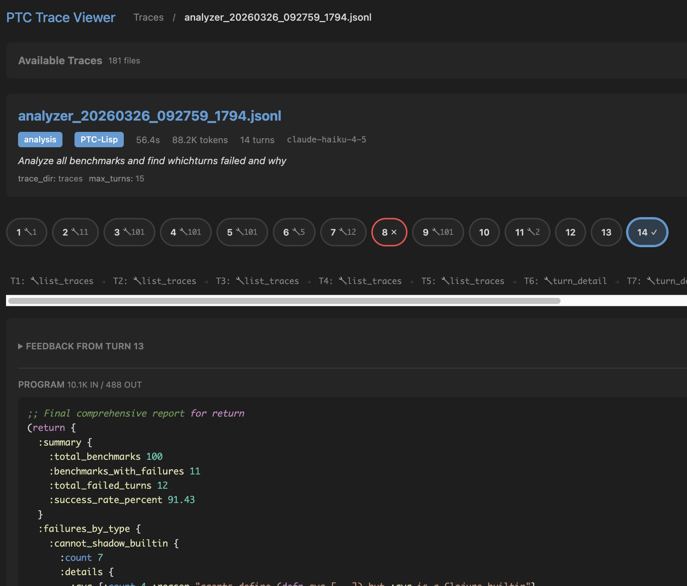

# Why I Built a Lisp for AI Agents

*PTC-Lisp: a sandboxed language for programmatic tool calling on the BEAM*

---

The idea that LLMs should generate code instead of calling tools one at a time is gaining momentum. Cloudflare validated it with Dynamic Workers — [sandboxing AI agents 100x faster](https://blog.cloudflare.com/dynamic-workers/) using generated JavaScript in V8 isolates. Anthropic described it as [Programmatic Tool Calling](https://www.anthropic.com/engineering/advanced-tool-use), where Claude writes Python to orchestrate tools inside a code execution environment.

The direction is right. But both approaches rely on general-purpose languages with enormous surface areas. JavaScript can do almost anything. Python can import almost anything. When you let an LLM write code in those languages, safety becomes an infrastructure problem: containers, sandboxed runtimes, hardened isolates.

What if you started from the other end? Instead of constraining a powerful language from the outside, what if the language itself was the constraint?

That is the question [ptc_runner](https://github.com/andreasronge/ptc_runner) explores.

## Code as the Agent Interface

The core insight behind code-first agents is straightforward.

With ordinary tool calling:

- every step is another inference pass
- intermediate results get pushed back into context
- latency compounds
- token usage grows with the number of tool hops
- the model spends time "being the computer"

With generated code:

- the model plans once
- the runtime executes deterministically
- intermediate state stays in memory
- the model only sees the parts that matter


Once you accept that code is a better agent interface than sequential tool calls, two design questions follow: *what language should the model write?* and *what runtime should execute it?*

## A Language Built for LLM Generation

PTC-Runner's answer to the first question is **PTC-Lisp**, a small subset of Clojure designed for data transformation, tool orchestration, and multi-turn agent loops.

In a general-purpose language, arbitrary code execution is the starting point, and safety is imposed from the outside — containers, V8 isolates, restricted Python environments.

In PTC-Lisp, dangerous capabilities do not exist in the first place:

- no filesystem, network, or dynamic module access
- no `eval` or `import`
- no hidden side effects outside declared tools

Here is what PTC-Lisp looks like in practice — a multi-turn agent fetching and filtering data:

```clojure
;; Turn 1: fetch orders and store them. Data stays in runtime memory.
(def orders (tool/get_orders {:status "pending"}))
(println "Pending orders:" (count orders))

;; Turn 2: filter and aggregate — orders never re-enter the LLM's context.
(->> orders
     (filter #(> (:amount %) 100))
     (sum-by :amount))
```

Variables defined with `def` persist across turns, just like a REPL session. Tools live in the `tool/` namespace — the only way to interact with the outside world. Everything else is pure data transformation.

That makes the execution model easier to reason about, easier to analyze, and easier to recover from when the model writes imperfect code. And because the syntax is simple and regular (it is a Lisp), there are fewer ways to write something that is syntactically valid but semantically wrong.

## "But LLMs Know JavaScript Better Than Lisp"

This is the strongest argument against a custom language, and for a while I thought it might be the decisive one.

In practice, the answer has been more nuanced than I expected.

Clojure has a much smaller share of LLM training data compared to Python or JavaScript. I expected that gap to hurt. But in internal benchmarks across several models — including small, inexpensive ones like Claude Haiku 4.5 and Gemini 3.1 Flash Lite — PTC-Lisp generation works reliably. Simpler data queries typically converge on the first attempt. More complex multi-step tool orchestration occasionally requires the multi-turn recovery loop — which is exactly what it is designed for.

It turns out that short, regular, Clojure-like programs are well within the capabilities of modern models, even models that have seen far more Python and JavaScript during training. The regularity of the syntax helps — there is less room for subtle formatting or scoping errors compared to whitespace-sensitive or brace-heavy languages.

That does **not** prove that PTC-Lisp is "as easy as JavaScript" for all models or all workloads. But it does suggest that for small programs, a constrained Lisp subset is already good enough. And that is especially true when the runtime helps the model recover instead of demanding perfect code on the first attempt.

## REPL-Native: How LLMs Already Know How to Work

There is another advantage that is easy to overlook.

LLMs have been extensively trained on REPL interactions — Jupyter notebooks, Python REPLs, Clojure REPLs, shell sessions. They know the pattern: type an expression, see the result, type the next expression based on what you learned.

PTC-Runner's multi-turn loop maps directly to that pattern. Each turn is a REPL expression. The model writes a short program, sees the output, and writes the next program based on what it learned. Tools are loaded via a prelude, just like you would load libraries at the start of a REPL session. Variables defined with `def` persist across turns, just like REPL state.

This is not a workaround for imperfect generation. It is a natural way for models to explore and build up results incrementally — the same way a developer works in a REPL. The trace analyzer example later in this post shows this in action: the agent wrote 7 short programs across 7 turns, progressively drilling deeper into the data.

## Multi-Turn Recovery

The REPL-native design also makes recovery natural.

If the model writes incorrect PTC-Lisp, a few things can happen:

- parse or analysis errors come back with precise feedback
- signature mismatches explain which fields or types were wrong
- resource failures like timeout or heap exhaustion are surfaced explicitly

Because PTC-Runner controls the interpreter, it produces error messages specifically designed to help an LLM correct course. A generic Python traceback is noisy and often misleading. PTC-Lisp errors are concise and actionable.

That means the real question is not:

> Can the model write perfect Lisp in one shot?

It is:

> Can the model converge on a correct program quickly when the runtime gives it useful feedback?

That is a much more favorable problem — and the multi-turn loop makes it practical even for smaller or cheaper models that do not always get it right on the first attempt.

## Defense in Depth: Language + Runtime

PTC-Runner's safety model has two layers.


**Layer 1: The language.** Dangerous constructs do not exist. There is no way to write a PTC-Lisp program that accesses the filesystem, makes network calls, or imports arbitrary modules. The language itself is the first sandbox.

**Layer 2: The BEAM process.** Each PTC-Lisp program runs in its own Erlang process with configurable timeout and heap limits. If a program hangs, it gets killed. If it consumes too much memory — perhaps because a tool returned an unexpectedly large dataset — the process is shut down and the agent receives a clear explanation of why. It can then adapt: filter more aggressively, paginate, or take a different approach entirely.

This two-layer model matters because neither layer alone is sufficient. A safe language does not protect you from a tool that returns 10 million rows. Process-level resource limits do not help you reason about what the program is doing. Together, they cover both the code the model writes and the data the tools return.

### The BEAM: 30 Years of Process Isolation

The **BEAM** is the runtime behind Erlang and Elixir. It has been battle-tested for over 30 years in telecom systems where downtime is measured in minutes per year — systems that handle millions of concurrent calls and keep running when individual components fail.

That is not just stability. It is a runtime where process isolation and failure recovery are foundational, not bolted on after the fact. Every BEAM process has its own heap. Processes cannot corrupt each other's memory. If one crashes, a supervisor can restart it or report the failure. Spawning thousands of lightweight processes is normal — it is what the runtime was designed for.

These properties are exactly what you want for an agent runtime:

- **Isolation:** each execution has its own process and heap
- **Failure containment:** if one program crashes, the parent handles it gracefully
- **Cheap concurrency:** parallel tool calls run in parallel processes, no thread pools to configure
- **Supervision:** failures are expected and managed, not treated as catastrophic

No Docker containers, no process managers, no Python virtual environments. The BEAM gives you lightweight isolation, bounded execution, and natural concurrency without introducing a separate container orchestration story just to run tiny generated programs.

## Where PTC-Runner Shines

When you choose code-first agents, you are making several design decisions: hosted versus embedded, general-purpose versus constrained language, single-shot versus multi-turn, containerized versus process-isolated. PTC-Runner makes a specific set of choices that work well for certain problems:

- **Constrained language with a small attack surface.** The language is the sandbox. No need to worry about what the model might import or access.
- **Multi-turn correction over one-shot perfection.** The REPL-native loop means models can explore, recover, and converge — especially valuable for cheaper models.
- **Data stays in runtime memory, not in prompts.** Memory references let agents work with large datasets the LLM never "sees." An extraction agent can hand 10,000 records to an analysis agent through BEAM memory with type-safe contracts at each boundary.
- **Defense in depth.** Language-level safety plus BEAM process limits cover both the code and the data.
- **Parallel execution for free.** BEAM processes give you concurrent tool calls without async/await ceremony.
- **Full semantic tracing.** Every turn, every generated program, every tool call — inspectable and debuggable.
- **Embeds directly into Elixir applications.** No external services, no container orchestration, no separate runtime to manage.

## Do I Need to Be an Elixir Shop?

No. PTC-Runner can run as a standalone service that your application talks to via API or MCP — a log analyzer, a data pipeline agent, a RAG system. Your main application stays in whatever language it's in. You deploy a small Elixir service that does the agent work.

And the code that matters most — the generated programs — is PTC-Lisp, not Elixir. Your developers configure tools and signatures in Elixir, but that's a thin layer. The agent logic is written by the LLM in a Clojure-like language. You choose Elixir for the BEAM runtime properties described above, not because your team needs to become an Elixir shop.

## Observability: Agents You Can Actually Debug

Most agent frameworks give you infrastructure-level logs — HTTP requests, container lifecycle events, maybe some structured logging. When an agent makes a bad decision three steps ago and you only notice the downstream effect, those logs do not help you understand *why*.

PTC-Runner records structured traces at the agent level: the generated program, parsed AST, tool calls with arguments and results, memory mutations, execution time, and any errors. You can trace exactly what happened, what the model was thinking, and where things went wrong.

There is also a built-in trace viewer:

```bash
mix ptc.viewer --trace-dir path/to/traces
```

It shows the full execution from the high-level task graph down to individual agent turns. When something goes wrong (and it will), you can trace exactly where.


*Debugging the debugger: the trace viewer inspecting a log analyzer agent's 14-turn execution.*

### Agents Debugging Agents: A Concrete Example

To make this concrete: PTC-Runner includes a trace analyzer that is itself a PTC-Lisp agent. You give it a natural language query, and it writes small programs to investigate execution traces.

Here is what happened when I asked it to analyze over a thousand JSONL benchmark trace files for the Gemini Flash 3.1 Lite Preview model.

The agent listed traces, filtered for the right model, fetched summaries, and initially thought everything passed. But it kept investigating — checking turn-level results for error patterns across 7 turns — and eventually returned a structured diagnosis:

```clojure
(return {:summary "Gemini Flash Lite Preview Benchmarks Analysis"
         :total 100
         :passed 95
         :failed 5
         :failure-reason "Unsupported Java interop methods (.isBefore, .isAfter on LocalDate)"
         :root-cause "Agent generated code using date comparison methods not in restricted interop list."})
```

The root cause: the model generated code calling `.isBefore` and `.isAfter` on `LocalDate` — methods not in the sandbox's allowed interop list. In a general-purpose runtime, this code would have executed without complaint. The sandbox caught it and returned a precise error. The agent found the problem, a human verified and fixed it, and the same benchmarks now pass.

That cycle — agent finds a pattern in traces, human acts on the diagnosis — is what operational observability looks like in practice. Not just "we have logs," but "an agent can read those logs programmatically and tell you what went wrong."

## The Bigger Point

I do not think the long-term winner in agent infrastructure is sequential tool calling — one inference pass per tool invocation, intermediate results shuffled back into context, latency and token costs growing with every hop.

I think more systems will converge on programmatic tool calling — what Anthropic calls [PTC](https://www.anthropic.com/engineering/advanced-tool-use) and what Cloudflare is enabling with Dynamic Workers:

1. the model writes a compact program
2. the runtime executes it with strong constraints
3. data stays in memory, not in prompts
4. the model retries when execution feedback says it was wrong

The interesting part is not whether the generated code is JavaScript, Python, or Lisp. The interesting part is that once you accept **code as the agent interface**, the language and runtime design become first-class decisions — not afterthoughts.

PTC-Runner is still a `0.x` library under active development. But the question it is exploring — what does the right language for agent-generated code actually look like? — is one I think is worth taking seriously.

On a personal note: I first encountered Lisp through Emacs in the late 80s, when it was still *the* AI language — the one McCarthy designed for AI research in 1958. Through the 90s, Lisp powered genetic programming, expert systems, and symbolic reasoning. Then Python took that role, and for good reason. But for agent-generated code — where simplicity, regularity, and REPL interaction matter more than library ecosystems — the old arguments for Lisp turn out to be new again. Not because we are going back. Because the problem changed.

---

*[ptc_runner on GitHub](https://github.com/andreasronge/ptc_runner) · [Hex package](https://hex.pm/packages/ptc_runner) · [Documentation](https://hexdocs.pm/ptc_runner)*
