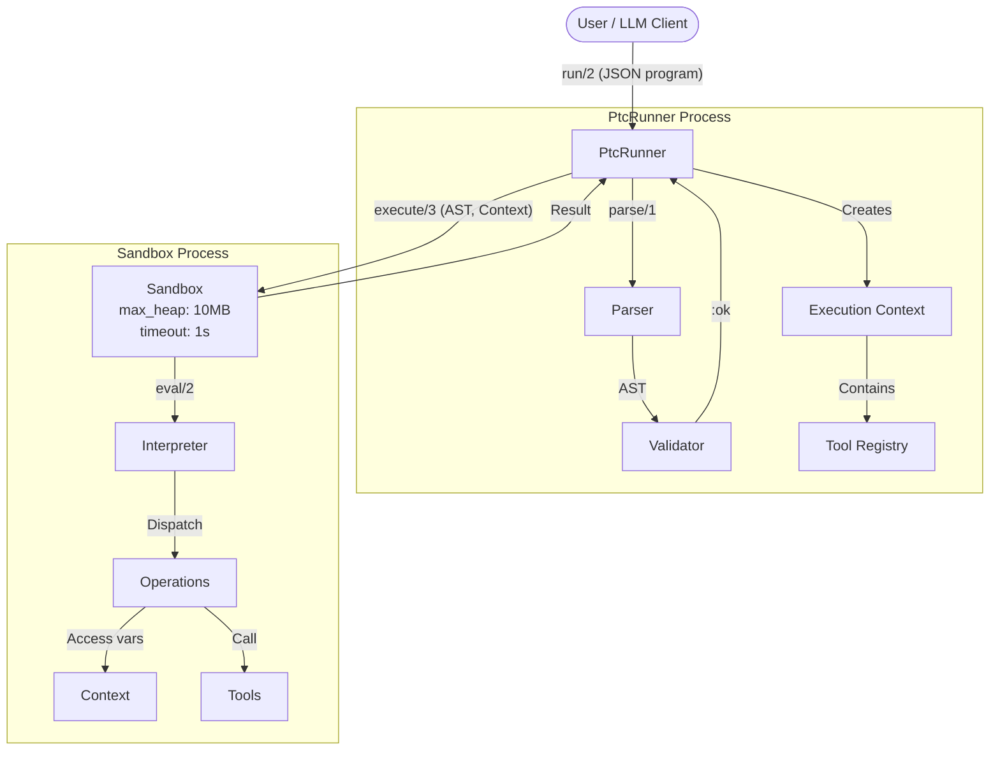

# PtcRunner Architecture

## Overview

PtcRunner is a BEAM-native library for executing Programmatic Tool Calling (PTC) programs. It provides a safe, controlled environment for running LLM-generated data transformation and tool orchestration code.



The diagram shows the two-phase execution model: first the JSON program is parsed and validated in the main process, then execution happens in an isolated sandbox process with memory and timeout limits. The Context (containing variables and registered tools) is passed into the sandbox where the Interpreter dispatches operations.

## Design Principles

1. **Safety First**: Programs run in isolated processes with resource limits
2. **Simplicity**: JSON DSL is easy for LLMs to generate and humans to debug
3. **Composability**: Operations chain via `pipe`, results can be stored and referenced
4. **Extensibility**: Users register their own tools as simple functions
5. **Execution Only**: No LLM integration—compose with ReqLLM or other clients externally

## Module Structure

```
lib/
├── ptc_runner.ex                 # Public API: run/2, run!/2
├── ptc_runner/
│   ├── sandbox.ex                # Shared: Process isolation + resource limits
│   ├── context.ex                # Shared: Variable bindings and tool registry
│   ├── schema.ex                 # Shared: Operation definitions for validation
│   │
│   ├── json/                     # JSON DSL implementation
│   │   ├── parser.ex             # JSON parsing → AST
│   │   ├── validator.ex          # AST schema validation
│   │   ├── interpreter.ex        # AST evaluation
│   │   └── operations.ex         # Built-in operations
│   │
│   └── lisp/                     # PTC-Lisp DSL implementation
│       ├── parser.ex             # S-expression parsing
│       ├── parser_helpers.ex     # Parsing utilities
│       ├── ast.ex                # RawAST type definitions
│       ├── analyze.ex            # RawAST → CoreAST validation/desugaring
│       ├── core_ast.ex           # CoreAST type definitions
│       ├── eval.ex               # CoreAST evaluation
│       ├── runtime.ex            # Builtin functions (~90 operations)
│       ├── schema.ex             # LLM prompt generation
│       └── env.ex                # Environment/bindings management
```

> **Note**: PTC-Lisp is a Clojure-like DSL that provides an alternative syntax
> to the JSON DSL. See `docs/api-refactor-plan.md` for implementation details.

## DSL Specifications

PtcRunner supports two DSL formats for writing programs:

| DSL | Status | Use Case | Documentation |
|-----|--------|----------|---------------|
| **PTC-JSON** | Stable | Universal compatibility, structured format | [ptc-json-specification.md](ptc-json-specification.md) |
| **PTC-Lisp** | Stable | Token efficiency, closures, complex predicates | [ptc-lisp-specification.md](ptc-lisp-specification.md) |

### Quick Comparison

**PTC-JSON** (verbose but universal):
```json
{
  "program": {
    "op": "pipe",
    "steps": [
      {"op": "load", "name": "expenses"},
      {"op": "filter", "where": {"op": "eq", "field": "category", "value": "travel"}},
      {"op": "sum", "field": "amount"}
    ]
  }
}
```

**PTC-Lisp** (compact, Clojure-like):
```clojure
(->> ctx/expenses
     (filter (where :category = "travel"))
     (sum-by :amount))
```

### When to Use Each

| Consideration | PTC-JSON | PTC-Lisp |
|---------------|----------|----------|
| Token efficiency | ~1x (baseline) | ~3-5x better |
| Parser complexity | `JSON.decode` | NimbleParsec |
| Error location | Exact position | Harder to pinpoint |
| Anonymous functions | Not supported | `(fn [x] body)` |
| Closures | Not supported | Yes |
| LLM familiarity | Universal | Clojure subset |

**Use PTC-JSON when:** Stability matters, simple pipelines suffice, universal tooling needed.

**Use PTC-Lisp when:** Token costs matter, complex predicates needed, closures required.

See the individual specification documents for complete operation references and examples.

### Tested With

Both DSLs are tested with cost-efficient models to ensure reliable code generation:

| Model | Provider | Notes |
|-------|----------|-------|
| DeepSeek V3.2 | DeepSeek | 90%+ pass rate on PTC-Lisp |
| Kimi K2 | Moonshot | Good Clojure-style generation |
| Claude Haiku 4.5 | Anthropic | Reliable structured output |
| GPT-5.1 Codex mini | OpenAI | Fast, optimized for code tasks |

The DSLs are designed for LLM code generation—compact syntax, predictable patterns, and clear error messages for retry loops.

## Public API

### `PtcRunner.run/2`

Execute a PTC program with options.

```elixir
@spec run(String.t() | map(), keyword()) ::
  {:ok, any(), metrics()} | {:error, error()}

@type metrics :: %{
  duration_ms: non_neg_integer(),
  memory_bytes: non_neg_integer()
}

@type error ::
  {:parse_error, String.t()} |
  {:validation_error, String.t()} |
  {:execution_error, String.t()} |
  {:timeout, non_neg_integer()} |
  {:memory_exceeded, non_neg_integer()}
```

**Options:**
- `:context` - Map of pre-bound variables (default: `%{}`)
- `:tools` - Map of tool name to function (default: `%{}`)
- `:timeout` - Execution timeout in ms (default: `1000`)
- `:max_heap` - Max heap size in words (default: `1_250_000` ≈ 10MB)

**PTC-Lisp Additional Options** (via `PtcRunner.Lisp.run/2`):
- `:memory` - Initial memory map (default: `%{}`)
- `:float_precision` - Decimal places for floats in result (default: `nil` = full precision)

**Example:**
```elixir
{:ok, result, metrics} = PtcRunner.run(
  program_json,
  context: %{"data" => [1, 2, 3]},
  tools: %{"fetch" => &MyApp.fetch/1},
  timeout: 5000
)

IO.inspect(metrics)
# %{duration_ms: 42, memory_bytes: 102400}
```

### `PtcRunner.run!/2`

Same as `run/2` but raises on error.

```elixir
result = PtcRunner.run!(program_json, opts)
```

### `PtcRunner.format_error/1`

Convert error tuples to LLM-friendly messages for retry loops.

```elixir
case PtcRunner.run(program) do
  {:ok, result, _} -> result
  {:error, err} ->
    # Returns string like "Type error: expected list, got string"
    PtcRunner.format_error(err)
end
```

## Tool Registration

Tools are simple functions that receive arguments and return results.

```elixir
# Define tools as a map of name => function
tools = %{
  "get_expenses" => fn _args ->
    # Return data directly
    [
      %{"id" => 1, "category" => "travel", "amount" => 500},
      %{"id" => 2, "category" => "food", "amount" => 50}
    ]
  end,

  "get_user" => fn %{"id" => id} ->
    # Tools receive args as a map
    MyApp.Users.get(id)
  end,

  "search" => fn %{"query" => query, "limit" => limit} ->
    MyApp.Search.run(query, limit: limit)
  end
}

# Use with run/2
PtcRunner.run(program, tools: tools)
```

**Tool Function Contract:**
- Receives: `map()` of arguments (may be empty `%{}`)
- Returns: Any Elixir term (maps, lists, primitives)
- Should not raise (return `{:error, reason}` for errors)

## Resource Limits

### Default Limits

| Resource | Default | Notes |
|----------|---------|-------|
| Timeout | 1,000 ms | Execution time limit |
| Max Heap | ~10 MB | Memory limit (1,250,000 words) |

### Configuring Limits

```elixir
# Per-call configuration
PtcRunner.run(program,
  timeout: 5000,      # 5 seconds
  max_heap: 5_000_000 # ~40MB
)

# Application-level defaults (in config.exs)
config :ptc_runner,
  default_timeout: 2000,
  default_max_heap: 2_500_000
```

### Execution Metrics

Every successful execution returns metrics:

```elixir
{:ok, result, metrics} = PtcRunner.run(program)

metrics
# %{
#   duration_ms: 42,        # Actual execution time
#   memory_bytes: 102400    # Peak memory usage
# }
```

### Error Handling

Resource limit errors include the limit that was exceeded:

```elixir
case PtcRunner.run(program, timeout: 100) do
  {:ok, result, metrics} ->
    handle_success(result)

  {:error, {:timeout, 100}} ->
    Logger.warning("Program exceeded 100ms timeout")

  {:error, {:memory_exceeded, bytes}} ->
    Logger.warning("Program exceeded memory limit: #{bytes} bytes")

  {:error, {:parse_error, msg}} ->
    Logger.error("Invalid JSON: #{msg}")

  {:error, {:validation_error, msg}} ->
    Logger.error("Invalid program: #{msg}")

  {:error, {:execution_error, msg}} ->
    Logger.error("Runtime error: #{msg}")
end
```

## Sandbox Implementation

Programs execute in isolated BEAM processes with resource limits:

```elixir
defmodule PtcRunner.Sandbox do
  @default_timeout 1_000
  @default_max_heap 1_250_000  # ~10MB (1 word = 8 bytes on 64-bit)

  def execute(ast, context, opts) do
    timeout = Keyword.get(opts, :timeout, @default_timeout)
    max_heap = Keyword.get(opts, :max_heap, @default_max_heap)

    parent = self()

    {pid, ref} = Process.spawn(fn ->
      Process.flag(:priority, :normal)
      result = Interpreter.eval(ast, context)
      memory = Process.info(self(), :memory) |> elem(1)
      send(parent, {:result, result, memory})
    end, [
      :monitor,
      {:max_heap_size, max_heap}
    ])

    start_time = System.monotonic_time(:millisecond)

    receive do
      {:result, result, memory} ->
        duration = System.monotonic_time(:millisecond) - start_time
        {:ok, result, %{duration_ms: duration, memory_bytes: memory}}

      {:DOWN, ^ref, :process, ^pid, :killed} ->
        {:error, {:memory_exceeded, max_heap * 8}}

      {:DOWN, ^ref, :process, ^pid, reason} ->
        {:error, {:execution_error, inspect(reason)}}
    after
      timeout ->
        Process.exit(pid, :kill)
        {:error, {:timeout, timeout}}
    end
  end
end
```

## Error Messages for LLM Consumption

Errors are structured for easy LLM retry loops:

```elixir
# Parse error
{:error, {:parse_error, "Unexpected token at position 42: expected '\"' but found '}"}}

# Validation error
{:error, {:validation_error, "Unknown operation 'filer'. Did you mean 'filter'?"}}

# Execution error
{:error, {:execution_error, "Cannot access field 'name' on nil. Path: users[0].profile.name"}}

# Timeout
{:error, {:timeout, 1000}}  # Program took longer than 1000ms

# Memory exceeded
{:error, {:memory_exceeded, 10485760}}  # Exceeded ~10MB limit
```

### PTC-Lisp Error Examples

```elixir
iex> PtcRunner.Lisp.run("(+ 1 2")
{:error, {:parse_error, "expected string \")\" at line 1, column 7: \"\""}}

iex> PtcRunner.Lisp.run("(foobar 1 2)")
{:error, {:unbound_var, :foobar}}

iex> PtcRunner.Lisp.run("(if true 1)")
{:error, {:invalid_arity, :if, "expected (if cond then else)"}}
```

## Integration with LLMs

PtcRunner does not include LLM integration—compose it with your LLM client:

```elixir
defmodule MyApp.PTCAgent do
  @system_prompt """
  You are a data processing assistant. Generate JSON programs using this DSL:

  Operations: pipe, filter, map, sum, count, call, let, var, if
  Comparisons: eq, neq, gt, gte, lt, lte, contains
  Logic: and, or, not

  Example:
  {"program": {"op": "pipe", "steps": [
    {"op": "call", "tool": "get_data"},
    {"op": "filter", "where": {"op": "gt", "field": "value", "value": 100}},
    {"op": "sum", "field": "amount"}
  ]}}

  Available tools: #{inspect(@tools)}
  """

  def run(user_request, context \\ %{}) do
    # 1. Generate program via LLM
    {:ok, response} = ReqLLM.generate_text(
      "openrouter:anthropic/claude-3-sonnet",
      user_request,
      system: @system_prompt
    )

    program = extract_json(response)

    # 2. Execute program
    case PtcRunner.run(program, context: context, tools: @tools) do
      {:ok, result, _metrics} ->
        {:ok, result}

      {:error, error} ->
        # 3. Optionally retry with error feedback
        retry_with_error(user_request, program, error)
    end
  end
end
```

See `test/e2e/llm_integration_test.exs` for complete examples.

## Dependencies

Required:
- `jason` - JSON parsing

Optional (for E2E tests):
- `req_llm` - LLM integration examples

## References

- [Anthropic PTC Blog Post](https://www.anthropic.com/research/ptc)
- [Open-PTC-Agent (Python)](https://github.com/Chen-zexi/open-ptc-agent)
- [ReqLLM Documentation](https://hexdocs.pm/req_llm)
