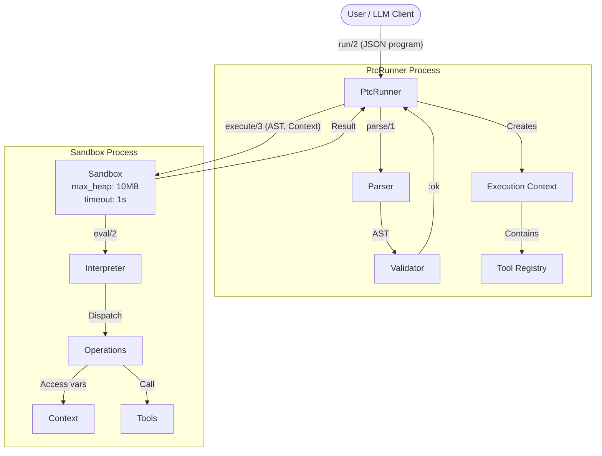

# PtcRunner Architecture

## Overview

PtcRunner is a BEAM-native library for executing Programmatic Tool Calling (PTC) programs. It provides a safe, controlled environment for running LLM-generated data transformation and tool orchestration code.



The diagram shows the two-phase execution model: first the JSON program is parsed and validated in the main process, then execution happens in an isolated sandbox process with memory and timeout limits. The Context (containing variables and registered tools) is passed into the sandbox where the Interpreter dispatches operations.

## Design Principles

1. **Safety First**: Programs run in isolated processes with resource limits
2. **Simplicity**: JSON DSL is easy for LLMs to generate and humans to debug
3. **Composability**: Operations chain via `pipe`, results can be stored and referenced
4. **Extensibility**: Users register their own tools as simple functions
5. **Execution Only**: No LLM integration—compose with ReqLLM or other clients externally

## Module Structure

```
lib/
├── ptc_runner.ex                 # Public API: run/2, run!/2
├── ptc_runner/
│   ├── parser.ex                 # JSON parsing
│   ├── validator.ex              # Schema validation
│   ├── interpreter.ex            # AST evaluation
│   ├── operations.ex             # Built-in operations
│   ├── sandbox.ex                # Process isolation + resource limits
│   ├── context.ex                # Variable bindings and tool registry
│   └── schema.ex                 # Operation definitions for validation
```

## DSL Specification

### Format

The DSL uses JSON for maximum LLM compatibility. Programs are composed of operations that transform data.

### Variable Bindings

Programs can store intermediate results and reference them later. This enables:
- Storing tool call results for later use
- Combining data from multiple tool calls
- Building complex pipelines across conversation turns

```json
{
  "program": {
    "op": "let",
    "name": "expenses",
    "value": {"op": "call", "tool": "get_expenses"},
    "in": {
      "op": "pipe",
      "steps": [
        {"op": "var", "name": "expenses"},
        {"op": "filter", "where": {"op": "eq", "field": "category", "value": "travel"}},
        {"op": "sum", "field": "amount"}
      ]
    }
  }
}
```

### Context

The execution context contains:
- **Variables**: Named bindings from `let` expressions or passed in
- **Tools**: Registered tool functions
- **Results**: Previous tool call results (for multi-turn conversations)

```elixir
# Running with pre-bound context (e.g., from previous conversation turns)
PtcRunner.run(program,
  context: %{
    "previous_expenses" => [...],  # Result from earlier tool call
    "user_preferences" => %{...}
  },
  tools: %{
    "get_expenses" => &MyApp.get_expenses/1
  }
)
```

### Operations

#### Data Operations

| Operation | Description | Example |
|-----------|-------------|---------|
| `literal` | Literal value | `{"op": "literal", "value": 42}` |
| `var` | Reference a variable | `{"op": "var", "name": "expenses"}` |
| `load` | Load from context | `{"op": "load", "name": "data"}` |
| `let` | Bind a value to a name | `{"op": "let", "name": "x", "value": ..., "in": ...}` |

#### Collection Operations

| Operation | Description | Example |
|-----------|-------------|---------|
| `pipe` | Chain operations | `{"op": "pipe", "steps": [...]}` |
| `filter` | Keep matching items | `{"op": "filter", "where": {...}}` |
| `reject` | Remove matching items | `{"op": "reject", "where": {...}}` |
| `map` | Transform each item | `{"op": "map", "expr": {...}}` |
| `select` | Pick specific fields | `{"op": "select", "fields": ["id", "name"]}` |
| `sort_by` | Sort by field | `{"op": "sort_by", "field": "price", "order": "asc"}` |
| `first` | Get first item | `{"op": "first"}` |
| `last` | Get last item | `{"op": "last"}` |
| `nth` | Get nth item (0-indexed) | `{"op": "nth", "index": 2}` |
| `count` | Count items | `{"op": "count"}` |

#### Aggregation Operations

| Operation | Description | Example |
|-----------|-------------|---------|
| `sum` | Sum a field | `{"op": "sum", "field": "amount"}` |
| `avg` | Average a field | `{"op": "avg", "field": "amount"}` |
| `min` | Minimum value | `{"op": "min", "field": "amount"}` |
| `max` | Maximum value | `{"op": "max", "field": "amount"}` |
| `min_by` | Row with min value | `{"op": "min_by", "field": "price"}` |
| `max_by` | Row with max value | `{"op": "max_by", "field": "years"}` |

#### Access Operations

| Operation | Description | Example |
|-----------|-------------|---------|
| `get` | Get single field | `{"op": "get", "field": "name"}` |
| `get` | Get nested field | `{"op": "get", "path": ["user", "profile", "email"]}` |
| `get` | Get with default | `{"op": "get", "field": "x", "default": 0}` |

#### Introspection Operations

| Operation | Description | Example |
|-----------|-------------|---------|
| `keys` | Get sorted keys of a map | `{"op": "keys"}` |
| `typeof` | Get type of current value | `{"op": "typeof"}` |

#### Comparison Operations

| Operation | Description | Example |
|-----------|-------------|---------|
| `eq` | Equals | `{"op": "eq", "field": "status", "value": "active"}` |
| `neq` | Not equals | `{"op": "neq", "field": "status", "value": "deleted"}` |
| `gt` | Greater than | `{"op": "gt", "field": "age", "value": 18}` |
| `gte` | Greater than or equal | `{"op": "gte", "field": "score", "value": 100}` |
| `lt` | Less than | `{"op": "lt", "field": "price", "value": 50}` |
| `lte` | Less than or equal | `{"op": "lte", "field": "quantity", "value": 10}` |
| `contains` | String/list contains | `{"op": "contains", "field": "tags", "value": "urgent"}` |

#### Logic Operations

| Operation | Description | Example |
|-----------|-------------|---------|
| `and` | Logical AND | `{"op": "and", "conditions": [...]}` |
| `or` | Logical OR | `{"op": "or", "conditions": [...]}` |
| `not` | Logical NOT | `{"op": "not", "condition": {...}}` |
| `if` | Conditional | `{"op": "if", "condition": ..., "then": ..., "else": ...}` |

#### Tool Operations

| Operation | Description | Example |
|-----------|-------------|---------|
| `call` | Call a registered tool | `{"op": "call", "tool": "get_users", "args": {...}}` |

#### Combine Operations

| Operation | Description | Example |
|-----------|-------------|---------|
| `merge` | Merge objects | `{"op": "merge", "objects": [{"op": "var", "name": "a"}, {"op": "var", "name": "b"}]}` |
| `concat` | Concatenate lists | `{"op": "concat", "lists": [...]}` |
| `zip` | Zip lists together | `{"op": "zip", "lists": [...]}` |

## Semantic Specifications

This section clarifies edge cases and behavior for v1.0.

### Variable and Context Access

**`load` vs `var`:**
- `load` reads from the **context** passed to `run/2` (external data)
- `var` reads from **let bindings** within the program (internal variables)
- Both return `nil` if the name doesn't exist (no error)

**`let` scoping:**
- Inner `let` bindings shadow outer bindings with the same name
- Bindings are only visible within the `in` expression

**Circular references:**
- `let x = var("x")` is allowed but returns `nil` (var evaluated before binding exists)
- No explicit cycle detection needed

### Pipe and Collection Behavior

**Empty `pipe`:**
- `{"op": "pipe", "steps": []}` returns `nil`

**`pipe` input:**
- First step receives `nil` as input (unless it's `load`, `var`, `call`, or `literal`)
- Each subsequent step receives the previous step's output

**Current item in `map`:**
- Inside a `map` expression, `{"op": "get", "path": []}` returns the current item
- Empty path `[]` always means "current value in scope"

### Type Handling

**Collection operations on wrong types:**
- `filter`, `map`, `reject` on non-list → `{:error, {:execution_error, "..."}}`
- `select` on non-map → error
- Operations fail fast with descriptive errors

**`nth` with invalid index:**
- Negative indices → error (not supported in v1)
- Out of bounds → returns `nil`

**`get` path semantics:**
- Path elements are always **string keys** for maps
- For lists, use `nth` operation (not `get` with numeric path)
- `{"op": "get", "path": ["0"]}` looks for key `"0"`, not index 0

### Introspection Operations

**`keys` behavior:**
- Returns a sorted list of all keys in a map
- Empty map returns empty list `[]`
- Non-map inputs return error with clear message
- Use in combination with `get` for nested exploration

**`typeof` return values:**
- `"object"` for maps (`is_map/1`)
- `"list"` for lists (`is_list/1`)
- `"string"` for binary strings (`is_binary/1`)
- `"number"` for integers and floats (`is_number/1`)
- `"boolean"` for true/false (`is_boolean/1`)
- `"null"` for nil

**Multi-turn exploration patterns:**
- LLMs can call `typeof` to discover data structure type
- Combine with `keys` to explore object fields: `pipe` → `get` → `typeof` then `get` → `keys`
- Use `first` with introspection to explore list items: `first` → `typeof` then `first` → `keys`

### Comparison Operations

**`contains` behavior by type:**
- On **list**: checks if value is a member (`value in list`)
- On **string**: checks substring (`String.contains?/2`)
- On **map**: checks if key exists (`Map.has_key?/2`)
- On other types: returns `false`

**Field-based comparisons:**
- All comparison ops (`eq`, `gt`, etc.) use `field` to access the current item
- To compare the current value directly, use `field: nil` or omit `field`

**Comparing expressions (out of scope for v1):**
- No `{"op": "gt", "left": expr, "right": expr}` syntax
- Use `let` bindings to achieve this if needed

### Aggregation Edge Cases

**Empty collections:**

| Operation | Empty List Result |
|-----------|------------------|
| `sum` | `0` |
| `count` | `0` |
| `avg` | `nil` |
| `min` | `nil` |
| `max` | `nil` |
| `min_by` | `nil` |
| `max_by` | `nil` |
| `sort_by` | `[]` |

**Non-numeric fields:**
- `avg` skips non-numeric values entirely (not counted in denominator); `sum` errors on non-numeric values
- `min`, `max` use Elixir's term ordering
- `min_by`, `max_by` skip items with `nil` field values and return the entire row (not just the value)

### Logic Operations

**`if` without `else`:**
- `else` is **required** in v1
- Validation error if omitted

**Truthiness:**
- Only `false` and `nil` are falsy
- Empty list `[]`, empty string `""`, `0` are truthy (Elixir semantics)

### Combine Operations

**`merge` conflict resolution:**
- Later objects override earlier objects (last wins)
- `{"op": "merge", "objects": [{"a": 1}, {"a": 2}]}` → `{"a": 2}`

**`zip` length mismatch:**
- Stops at shortest list length
- `zip([[1,2,3], [a,b]])` → `[[1,a], [2,b]]`

**`concat` on non-lists:**
- Error if any element is not a list

### Tool Behavior

**Tool errors:**
- If tool returns `{:error, reason}` → program returns `{:error, {:execution_error, reason}}`
- If tool raises an exception → caught and converted to execution error
- Tool exceptions don't crash the sandbox

**Tool argument validation:**
- Tools receive raw args map—no schema validation in v1
- Tools should validate their own arguments
- Missing required args result in pattern match error (surfaced as execution error)

**Tool result size:**
- Tool results count toward memory limit
- Large tool results can trigger `{:error, {:memory_exceeded, ...}}`

**Async tools (out of scope for v1):**
- Tools must return synchronously
- Streaming, pagination handled by the tool internally

### Resource Limits

**Nesting depth:**
- Max nesting depth: 50 levels (configurable via `:max_depth`)
- Exceeding returns `{:error, {:validation_error, "Max nesting depth exceeded"}}`

**Operation count (out of scope for v1):**
- No limit on number of operations
- Rely on timeout and memory limits

### Out of Scope for v1

These features are intentionally deferred:

- **`group_by`**: Use tools for grouping
- **String operations** (`split`, `join`, `uppercase`, etc.): Use tools
- **Regex matching**: Use tools
- **Arithmetic operations** (`add`, `subtract`, etc.): Use tools or `let` with literals
- **Parallel tool execution**: Tools execute sequentially
- **Expression-based comparisons**: Use `let` bindings as workaround

## Example Programs

### Example 1: Filter and Sum Expenses

```json
{
  "program": {
    "op": "pipe",
    "steps": [
      {"op": "load", "name": "expenses"},
      {"op": "filter", "where": {"op": "eq", "field": "category", "value": "travel"}},
      {"op": "sum", "field": "amount"}
    ]
  }
}
```

### Example 2: Query Voice Call Transcripts

```json
{
  "program": {
    "op": "pipe",
    "steps": [
      {"op": "call", "tool": "get_voice_calls"},
      {"op": "filter", "where": {"op": "eq", "field": "status", "value": "completed"}},
      {"op": "filter", "where": {"op": "gt", "field": "duration_ms", "value": 60000}},
      {"op": "select", "fields": ["id", "transcript", "duration_ms"]}
    ]
  }
}
```

### Example 3: Combine Data from Multiple Sources

```json
{
  "program": {
    "op": "let",
    "name": "users",
    "value": {"op": "call", "tool": "get_users"},
    "in": {
      "op": "let",
      "name": "orders",
      "value": {"op": "call", "tool": "get_orders"},
      "in": {
        "op": "pipe",
        "steps": [
          {"op": "var", "name": "orders"},
          {"op": "filter", "where": {"op": "gt", "field": "total", "value": 100}},
          {"op": "map", "expr": {
            "op": "merge",
            "objects": [
              {"op": "get", "path": []},
              {"op": "pipe", "steps": [
                {"op": "var", "name": "users"},
                {"op": "filter", "where": {"op": "eq", "field": "id", "value": {"op": "get", "path": ["user_id"]}}},
                {"op": "first"},
                {"op": "select", "fields": ["name", "email"]}
              ]}
            ]
          }}
        ]
      }
    }
  }
}
```

### Example 4: Conditional Logic

```json
{
  "program": {
    "op": "pipe",
    "steps": [
      {"op": "load", "name": "invoice"},
      {"op": "let", "name": "total", "value": {"op": "get", "path": ["total"]}, "in": {
        "op": "if",
        "condition": {"op": "gt", "field": "total", "value": 1000},
        "then": {"op": "literal", "value": "high_value"},
        "else": {
          "op": "if",
          "condition": {"op": "gt", "field": "total", "value": 100},
          "then": {"op": "literal", "value": "medium_value"},
          "else": {"op": "literal", "value": "low_value"}
        }
      }}
    ]
  }
}
```

### Example 5: Using Previous Conversation Results

When running in a multi-turn conversation, previous results can be passed via context:

```elixir
# Turn 1: Get expenses
{:ok, expenses, _metrics} = PtcRunner.run(
  ~s({"program": {"op": "call", "tool": "get_expenses"}}),
  tools: tools
)

# Turn 2: Use previous result
{:ok, total, _metrics} = PtcRunner.run(
  ~s({
    "program": {
      "op": "pipe",
      "steps": [
        {"op": "load", "name": "previous_expenses"},
        {"op": "filter", "where": {"op": "eq", "field": "category", "value": "travel"}},
        {"op": "sum", "field": "amount"}
      ]
    }
  }),
  context: %{"previous_expenses" => expenses},
  tools: tools
)
```

## Public API

### `PtcRunner.run/2`

Execute a PTC program with options.

```elixir
@spec run(String.t() | map(), keyword()) ::
  {:ok, any(), metrics()} | {:error, error()}

@type metrics :: %{
  duration_ms: non_neg_integer(),
  memory_bytes: non_neg_integer()
}

@type error ::
  {:parse_error, String.t()} |
  {:validation_error, String.t()} |
  {:execution_error, String.t()} |
  {:timeout, non_neg_integer()} |
  {:memory_exceeded, non_neg_integer()}
```

**Options:**
- `:context` - Map of pre-bound variables (default: `%{}`)
- `:tools` - Map of tool name to function (default: `%{}`)
- `:timeout` - Execution timeout in ms (default: `1000`)
- `:max_heap` - Max heap size in words (default: `1_250_000` ≈ 10MB)

**Example:**
```elixir
{:ok, result, metrics} = PtcRunner.run(
  program_json,
  context: %{"data" => [1, 2, 3]},
  tools: %{"fetch" => &MyApp.fetch/1},
  timeout: 5000
)

IO.inspect(metrics)
# %{duration_ms: 42, memory_bytes: 102400}
```

### `PtcRunner.run!/2`

Same as `run/2` but raises on error.

```elixir
result = PtcRunner.run!(program_json, opts)
```

## Tool Registration

Tools are simple functions that receive arguments and return results.

```elixir
# Define tools as a map of name => function
tools = %{
  "get_expenses" => fn _args ->
    # Return data directly
    [
      %{"id" => 1, "category" => "travel", "amount" => 500},
      %{"id" => 2, "category" => "food", "amount" => 50}
    ]
  end,

  "get_user" => fn %{"id" => id} ->
    # Tools receive args as a map
    MyApp.Users.get(id)
  end,

  "search" => fn %{"query" => query, "limit" => limit} ->
    MyApp.Search.run(query, limit: limit)
  end
}

# Use with run/2
PtcRunner.run(program, tools: tools)
```

**Tool Function Contract:**
- Receives: `map()` of arguments (may be empty `%{}`)
- Returns: Any Elixir term (maps, lists, primitives)
- Should not raise (return `{:error, reason}` for errors)

## Resource Limits

### Default Limits

| Resource | Default | Notes |
|----------|---------|-------|
| Timeout | 1,000 ms | Execution time limit |
| Max Heap | ~10 MB | Memory limit (1,250,000 words) |

### Configuring Limits

```elixir
# Per-call configuration
PtcRunner.run(program,
  timeout: 5000,      # 5 seconds
  max_heap: 5_000_000 # ~40MB
)

# Application-level defaults (in config.exs)
config :ptc_runner,
  default_timeout: 2000,
  default_max_heap: 2_500_000
```

### Execution Metrics

Every successful execution returns metrics:

```elixir
{:ok, result, metrics} = PtcRunner.run(program)

metrics
# %{
#   duration_ms: 42,        # Actual execution time
#   memory_bytes: 102400    # Peak memory usage
# }
```

### Error Handling

Resource limit errors include the limit that was exceeded:

```elixir
case PtcRunner.run(program, timeout: 100) do
  {:ok, result, metrics} ->
    handle_success(result)

  {:error, {:timeout, 100}} ->
    Logger.warning("Program exceeded 100ms timeout")

  {:error, {:memory_exceeded, bytes}} ->
    Logger.warning("Program exceeded memory limit: #{bytes} bytes")

  {:error, {:parse_error, msg}} ->
    Logger.error("Invalid JSON: #{msg}")

  {:error, {:validation_error, msg}} ->
    Logger.error("Invalid program: #{msg}")

  {:error, {:execution_error, msg}} ->
    Logger.error("Runtime error: #{msg}")
end
```

## Sandbox Implementation

Programs execute in isolated BEAM processes with resource limits:

```elixir
defmodule PtcRunner.Sandbox do
  @default_timeout 1_000
  @default_max_heap 1_250_000  # ~10MB (1 word = 8 bytes on 64-bit)

  def execute(ast, context, opts) do
    timeout = Keyword.get(opts, :timeout, @default_timeout)
    max_heap = Keyword.get(opts, :max_heap, @default_max_heap)

    parent = self()

    {pid, ref} = Process.spawn(fn ->
      Process.flag(:priority, :normal)
      result = Interpreter.eval(ast, context)
      memory = Process.info(self(), :memory) |> elem(1)
      send(parent, {:result, result, memory})
    end, [
      :monitor,
      {:max_heap_size, max_heap}
    ])

    start_time = System.monotonic_time(:millisecond)

    receive do
      {:result, result, memory} ->
        duration = System.monotonic_time(:millisecond) - start_time
        {:ok, result, %{duration_ms: duration, memory_bytes: memory}}

      {:DOWN, ^ref, :process, ^pid, :killed} ->
        {:error, {:memory_exceeded, max_heap * 8}}

      {:DOWN, ^ref, :process, ^pid, reason} ->
        {:error, {:execution_error, inspect(reason)}}
    after
      timeout ->
        Process.exit(pid, :kill)
        {:error, {:timeout, timeout}}
    end
  end
end
```

## Error Messages for LLM Consumption

Errors are structured for easy LLM retry loops:

```elixir
# Parse error
{:error, {:parse_error, "Unexpected token at position 42: expected '\"' but found '}"}}

# Validation error
{:error, {:validation_error, "Unknown operation 'filer'. Did you mean 'filter'?"}}

# Execution error
{:error, {:execution_error, "Cannot access field 'name' on nil. Path: users[0].profile.name"}}

# Timeout
{:error, {:timeout, 1000}}  # Program took longer than 1000ms

# Memory exceeded
{:error, {:memory_exceeded, 10485760}}  # Exceeded ~10MB limit
```

## Integration with LLMs

PtcRunner does not include LLM integration—compose it with your LLM client:

```elixir
defmodule MyApp.PTCAgent do
  @system_prompt """
  You are a data processing assistant. Generate JSON programs using this DSL:

  Operations: pipe, filter, map, sum, count, call, let, var, if
  Comparisons: eq, neq, gt, gte, lt, lte, contains
  Logic: and, or, not

  Example:
  {"program": {"op": "pipe", "steps": [
    {"op": "call", "tool": "get_data"},
    {"op": "filter", "where": {"op": "gt", "field": "value", "value": 100}},
    {"op": "sum", "field": "amount"}
  ]}}

  Available tools: #{inspect(@tools)}
  """

  def run(user_request, context \\ %{}) do
    # 1. Generate program via LLM
    {:ok, response} = ReqLLM.generate_text(
      "openrouter:anthropic/claude-3-sonnet",
      user_request,
      system: @system_prompt
    )

    program = extract_json(response)

    # 2. Execute program
    case PtcRunner.run(program, context: context, tools: @tools) do
      {:ok, result, _metrics} ->
        {:ok, result}

      {:error, error} ->
        # 3. Optionally retry with error feedback
        retry_with_error(user_request, program, error)
    end
  end
end
```

See `test/e2e/llm_integration_test.exs` for complete examples.

## Dependencies

Required:
- `jason` - JSON parsing

Optional (for E2E tests):
- `req_llm` - LLM integration examples

## References

- [Anthropic PTC Blog Post](https://www.anthropic.com/research/ptc)
- [Open-PTC-Agent (Python)](https://github.com/Chen-zexi/open-ptc-agent)
- [ReqLLM Documentation](https://hexdocs.pm/req_llm)
