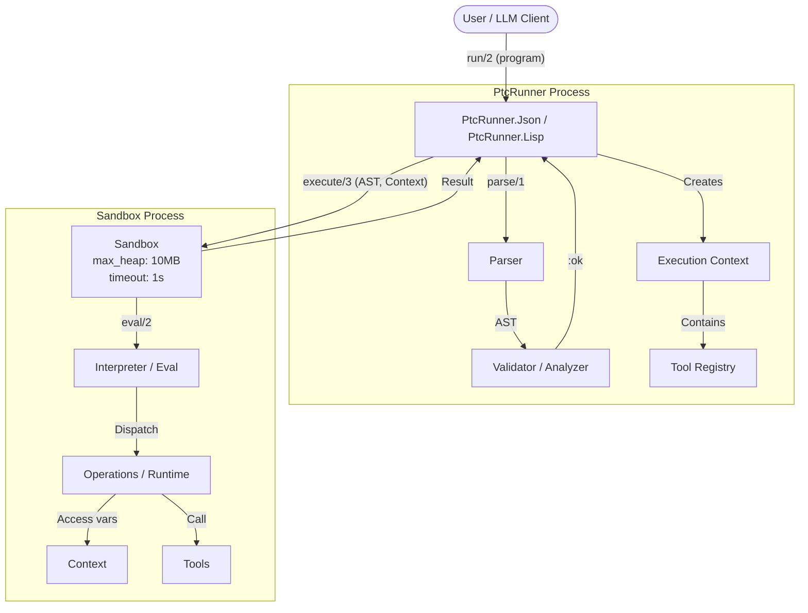

# PtcRunner Guide

## Architecture



Two-phase execution: parse and validate in the main process, then execute in an isolated sandbox with memory and timeout limits.

## Design Principles

1. **Safety First**: Programs run in isolated processes with resource limits
2. **Simplicity**: DSLs are easy for LLMs to generate and humans to debug
3. **Composability**: Operations chain via `pipe`, results can be stored and referenced
4. **Extensibility**: Users register their own tools as simple functions
5. **Execution Only**: No LLM integration—compose with ReqLLM or other clients

## DSL Specifications

- **[PTC-JSON Specification](ptc-json-specification.md)** - Complete JSON DSL reference
- **[PTC-Lisp Specification](ptc-lisp-specification.md)** - Complete Lisp DSL reference
- **[PTC-Lisp Overview](ptc-lisp-overview.md)** - Lisp DSL introduction

### Quick Comparison

**PTC-JSON**
```json
{
  "program": {
    "op": "pipe",
    "steps": [
      {"op": "load", "name": "expenses"},
      {"op": "filter", "where": {"op": "eq", "field": "category", "value": "travel"}},
      {"op": "sum", "field": "amount"}
    ]
  }
}
```

**PTC-Lisp**
```clojure
(->> ctx/expenses
     (filter (where :category = "travel"))
     (sum-by :amount))
```

## API Reference

### `PtcRunner.Json.run/2`

```elixir
@spec run(String.t() | map(), keyword()) ::
  {:ok, any(), map(), map()} | {:error, error()}

@type error ::
  {:parse_error, String.t()} |
  {:validation_error, String.t()} |
  {:execution_error, String.t()} |
  {:timeout, non_neg_integer()} |
  {:memory_exceeded, non_neg_integer()}
```

Returns `{:ok, result, memory_delta, new_memory}` on success.

**Options:**
- `:context` - Map of pre-bound variables (default: `%{}`)
- `:memory` - Map of initial memory state (default: `%{}`)
- `:tools` - Map of tool name to function (default: `%{}`)
- `:timeout` - Execution timeout in ms (default: `1000`)
- `:max_heap` - Max heap size in words (default: `1_250_000` ≈ 10MB)

### `PtcRunner.Lisp.run/2`

```elixir
@spec run(String.t(), keyword()) ::
  {:ok, any(), map(), map()} | {:error, error()}
```

Returns `{:ok, result, memory_delta, new_memory}` on success.

**Additional Options:**
- `:memory` - Initial memory map (default: `%{}`)
- `:float_precision` - Decimal places for floats (default: `nil` = full precision)

### `PtcRunner.Json.run!/2`

Same as `run/2` but raises on error.

### `PtcRunner.Json.format_error/1`

Convert error tuples to LLM-friendly messages for retry loops.

## Tool Registration

Tools are functions that receive arguments and return results:

```elixir
tools = %{
  "get_expenses" => fn _args ->
    [%{"id" => 1, "category" => "travel", "amount" => 500}]
  end,
  "get_user" => fn %{"id" => id} -> MyApp.Users.get(id) end,
  "search" => fn %{"query" => q, "limit" => n} -> MyApp.Search.run(q, limit: n) end
}

PtcRunner.Json.run(program, tools: tools)
```

**Contract:**
- Receives: `map()` of arguments (may be empty `%{}`)
- Returns: Any Elixir term (maps, lists, primitives)
- Should not raise (return `{:error, reason}` for errors)

## Resource Limits

| Resource | Default | Notes |
|----------|---------|-------|
| Timeout | 1,000 ms | Execution time limit |
| Max Heap | ~10 MB | Memory limit (1,250,000 words) |

```elixir
# Per-call configuration
PtcRunner.Json.run(program, timeout: 5000, max_heap: 5_000_000)

# Application-level defaults (in config.exs)
config :ptc_runner,
  default_timeout: 2000,
  default_max_heap: 2_500_000
```

### Error Handling

```elixir
case PtcRunner.Json.run(program) do
  {:ok, result, _memory_delta, _new_memory} -> handle_success(result)
  {:error, {:timeout, ms}} -> Logger.warning("Exceeded #{ms}ms timeout")
  {:error, {:memory_exceeded, bytes}} -> Logger.warning("Exceeded memory: #{bytes}")
  {:error, {:parse_error, msg}} -> Logger.error("Invalid JSON: #{msg}")
  {:error, {:validation_error, msg}} -> Logger.error("Invalid program: #{msg}")
  {:error, {:execution_error, msg}} -> Logger.error("Runtime error: #{msg}")
end
```

## LLM Integration

PtcRunner is execution-only. Compose with your LLM client (e.g., [ReqLLM](https://hexdocs.pm/req_llm)):

```elixir
defmodule MyApp.PTCAgent do
  @system_prompt """
  Generate JSON programs using this DSL:
  #{PtcRunner.Schema.to_prompt()}
  """

  def run(user_request, context \\ %{}) do
    {:ok, response} = ReqLLM.generate_text("anthropic:claude-haiku-4.5",
      user_request, system: @system_prompt)

    program = extract_json(response)

    case PtcRunner.Json.run(program, context: context, tools: @tools) do
      {:ok, result, _} -> {:ok, result}
      {:error, error} -> retry_with_error(user_request, program, error)
    end
  end
end
```

### Dynamic Context Refs

For large tool results, store them as context refs instead of returning to the LLM:

```elixir
def handle_tool_result(state, tool_name, result) do
  if large_result?(result) do
    ref = "#{tool_name}_#{System.unique_integer([:positive])}"
    state = %{state | context: Map.put(state.context, ref, result)}
    {state, {:context_ref, %{ref: ref, count: length(result)}}}
  else
    {state, {:inline, result}}
  end
end
```

The LLM queries via: `{"op": "load", "name": "get_orders_42"}`.

## Demo Application

The `demo/` directory contains an interactive chat application demonstrating PtcRunner with LLM integration:

- **Interactive CLI**: Query datasets using natural language
- **Both DSLs**: JSON (`mix run -e "PtcDemo.CLI.main([])"`) and Lisp (`mix lisp`)
- **Test Runner**: Automated tests to evaluate LLM program generation accuracy
- **Sample Data**: 2500 records across products, orders, employees, and expenses

See `demo/README.md` for setup and usage.

#### Running E2E Tests

E2E tests require an API key. Copy `.env.example` to `.env` and configure:

```bash
cp .env.example .env
# Edit .env with your OPENROUTER_API_KEY

# Run JSON DSL e2e tests
mix test test/ptc_runner/json/e2e_test.exs --include e2e

# Run Lisp DSL e2e tests
mix test test/ptc_runner/lisp/e2e_test.exs --include e2e

# Run all e2e tests
mix test --include e2e

# Run with specific model
PTC_TEST_MODEL=haiku mix test --include e2e
```

The same `.env` file is used by the demo application in `demo/`.

## Clojure Validation

PTC-Lisp is designed as a Clojure subset. You can validate programs against real Clojure using [Babashka](https://babashka.org/):

```bash
# Install Babashka (one-time)
mix ptc.install_babashka

# Run Clojure conformance tests
mix test --only clojure

# Skip Clojure tests (if Babashka not installed)
mix test --exclude clojure

# Demo test runner with Clojure syntax validation
cd demo && mix lisp --test --validate-clojure
```

### Known Differences from Clojure

The conformance tests have identified these semantic differences:

| Expression | PTC-Lisp | Clojure | Notes |
|------------|----------|---------|-------|
| `(or false false)` | `nil` | `false` | Short-circuit semantics |
| `(some pred coll)` when no match | `false` | `nil` | Return value on failure |
| `(and nil x)` | `nil` | `nil` | Same behavior |

These differences are intentional trade-offs for LLM-friendly behavior or are pending alignment.

## References

- [Anthropic PTC Blog Post](https://www.anthropic.com/research/ptc)
- [Open-PTC-Agent (Python)](https://github.com/Chen-zexi/open-ptc-agent)
- [ReqLLM Documentation](https://hexdocs.pm/req_llm)
