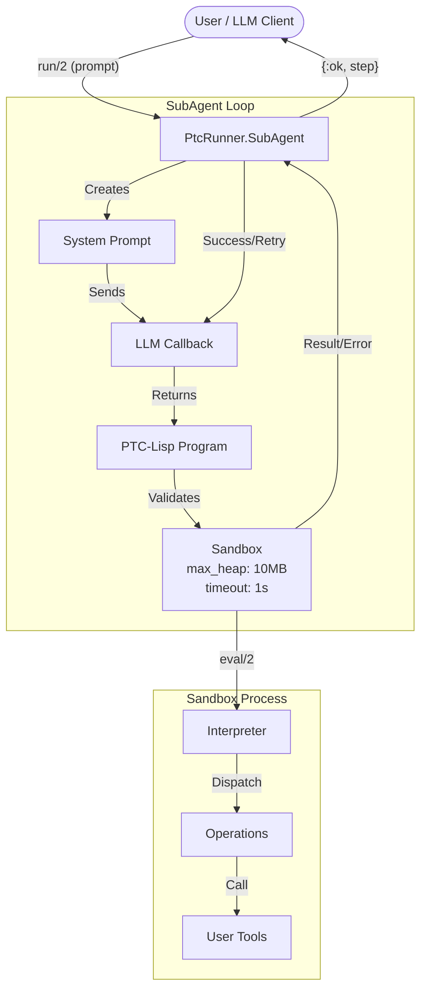

# PtcRunner Guide

## What is PtcRunner?

PtcRunner enables LLM agents that write and execute programs. The **SubAgent API** is the primary interface - it handles the agentic loop, tool calling, and result validation automatically.

For most use cases, start with the [SubAgent Getting Started guide](guides/subagent-getting-started.md).

## Architecture



SubAgents manage a loop: prompt the LLM, execute the returned program in a sandbox, validate results, and either return or retry. Programs run in isolated BEAM processes with memory and timeout limits.

## SubAgent Guides

- **[Getting Started](guides/subagent-getting-started.md)** - Build your first agent
- **[Core Concepts](guides/subagent-concepts.md)** - Context, memory, firewall convention
- **[Patterns](guides/subagent-patterns.md)** - Chaining, orchestration, composition
- **[Testing](guides/subagent-testing.md)** - Mocking LLMs, integration tests
- **[Troubleshooting](guides/subagent-troubleshooting.md)** - Common issues and solutions
- **[Advanced Topics](guides/subagent-advanced.md)** - Observability, compile pattern

## Low-Level APIs

For direct program execution without the agentic loop, PtcRunner provides two DSLs:

### PTC-Lisp

Compact, expressive Clojure subset. Used internally by SubAgents.

```elixir
{:ok, result, _delta, _memory} = PtcRunner.Lisp.run(
  "(->> ctx/users (filter (where :active)) (count))",
  context: %{users: users}
)
```

See `PtcRunner.Lisp` module docs and [PTC-Lisp Specification](ptc-lisp-specification.md).

### PTC-JSON

Verbose but schema-enforced. Useful when you need JSON Schema validation of LLM output.

```elixir
{:ok, result, _delta, _memory} = PtcRunner.Json.run(program_json, tools: tools)
```

See `PtcRunner.Json` module docs and [PTC-JSON Specification](reference/ptc-json-specification.md).

> **Note:** PTC-JSON is not supported in the SubAgent API. SubAgents use PTC-Lisp exclusively for its token efficiency and expressiveness.

## Design Principles

1. **Safety First**: Programs run in isolated processes with resource limits
2. **Simplicity**: DSLs are easy for LLMs to generate and humans to debug
3. **Composability**: Operations chain via threading; results can be stored and referenced
4. **Extensibility**: Users register their own tools as simple functions
5. **Execution Only**: No LLM integration in the core - SubAgent composes with your LLM client

## Demo Application

The `demo/` directory contains an interactive chat application demonstrating PtcRunner with LLM integration:

- **Interactive CLI**: Query datasets using natural language
- **Test Runner**: Automated tests to evaluate LLM program generation accuracy
- **Sample Data**: 2500 records across products, orders, employees, and expenses

See `demo/README.md` for setup and usage.

## References

- [Anthropic: Advanced Tool Use](https://www.anthropic.com/engineering/advanced-tool-use)
- [Anthropic: Code Execution with MCP](https://www.anthropic.com/engineering/code-execution-with-mcp)
