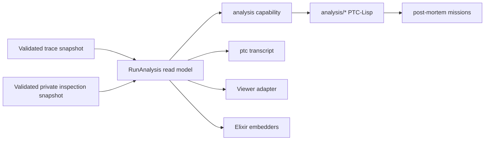

# Run-analysis read model

**Status:** implemented, pending merge; written 2026-08-12 for
[#1337](https://github.com/andreasronge/ptc_runner/issues/1337). The durable
contracts now live in `RunAnalysis` module documentation, the trace contract,
and the user guides. Remove this plan after the implementation merges.

PtcRunner already captures and validates enough evidence to reconstruct model
dialogue and explain many failed runs, but it exposes that evidence primarily
in storage shape. A caller must know whether a fact lives in the canonical
trace or private inspection artifact, select one of two profiles, page a
record-family query, and write the semantic join itself.

This plan replaces that public read surface with one question-shaped
`analysis/*` vocabulary. It retains separate public and private authority
recipes: one vocabulary does not mean one data class or one terminal policy.
The implementation is complete only when the new semantic code replaces more
plumbing and caller-side joining than it adds.

## Outcome

Five common questions will have direct, bounded answers:

1. Which runs are available?
2. What happened in this run?
3. What conversation did the model have?
4. Why did the run fail, and which programs are relevant?
5. What exact component source did the run execute?

The flagship private journey will become one command:

```console
ptc transcript RUN_ID \
  --traces traces \
  --inspection inspection \
  --private-unattended \
  --private-output transcript.private.json
```

An interactive investigator, Viewer, embedding application, or post-mortem
agent will use the same semantic operations and result shapes. None will
reconstruct conversations, pair errors with programs, or translate record
families independently.

## Decisions fixed by this plan

### Unify vocabulary, not authority

Public canonical traces and private inspection artifacts remain different
captures with different data classes. The new implementation will keep two
fixed analysis recipes:

- a public recipe that captures canonical traces and may write ordinary
  bounded JSON results; and
- a private recipe that captures private-authorized traces plus inspection
  artifacts and requires an attached private terminal or an explicitly
  authorized private output.

Both recipes will install the same `analysis` component and the same semantic
capability names. An operation whose evidence is unavailable in the public
recipe will return a stable `evidence_unavailable` error; it will never widen
authority or search the filesystem. The old `log/*` versus `inspection/*`
choice will disappear from user code.

Two authority recipes are deliberate. Making resource presence dynamically
change one profile's result classification or terminal rules would simplify a
name while obscuring the security contract.

### Build semantics in Elixir once

The semantic join belongs below PTC-Lisp and above the two validated primitive
readers. A pure `PtcRunner.Kernel.RunAnalysis` read model will compose an
immutable trace snapshot with an optional correlated inspection snapshot and
answer the semantic operations. Capability callbacks, the Viewer, the
one-shot CLI, and embedders will delegate to it.

PTC-Lisp will contain only thin bounded wrappers. The Viewer and CLI must not
reimplement joins in JavaScript, router code, or frontend formatting code.



`PtcRunner.Kernel.TraceLog`, `PtcRunner.Kernel.InspectionArtifact`, and the
snapshot validation owners remain the authorities for decoding, bounds,
correlation validation, immutable capture, and cursors. This refactor must not
duplicate or weaken them merely to reduce line count.

### Capture shape remains internal

Low-level record-family operations may remain internal building blocks and
Elixir maintenance APIs, but they will no longer be the only PTC-Lisp or
Viewer contract. No public semantic result will expose a storage cursor,
record-type name, or raw correlation map unless the result explicitly models
it as evidence provenance.

The refactor will continue to use `InspectionArtifact` as the sole inspection
decoder and validator. It will capture the authoritative trace snapshot first,
validate every inspection artifact against it, preserve exact capability,
request, evaluation, and result-hash correlation, and fail the complete
private catalog closed when any artifact cannot be correlated. Profile-backed
and manifest-backed sessions must publish byte-equivalent normalized semantic
results for the same captures.

### Breaking replacement, not compatibility

This is a 0.x replacement. After all repository consumers move, remove the
old profiles, components, namespaces, capability builders, provider source
types, Viewer routes, and documentation in the same implementation series. Do
not retain aliases or adapters for `log.analysis`, `inspection.analysis`, or
the old profile IDs.

## Measured baseline

Measured on `a7898306` on 2026-08-12:

| Current surface | Baseline |
| --- | ---: |
| Query prelude files / namespaces | 4 / 4 |
| Public prelude functions | 23 |
| Query prelude lines | 127 |
| Fixed analysis profiles | 2 modules, 445 lines |
| Trace plus inspection capability builders | 2 modules, 285 lines |
| Primitive profile capabilities | 13 |
| Viewer trace/inspection read routes | 5 |
| Provider aliases needed by a private post-mortem mission | 2 |
| Claim-check post-mortem facade | 150 lines, 10 functions |
| Named semantic conversation/failure projections | 0 |

The relevant existing read-side files total 5,699 lines. The frozen baseline
manifest is:

```text
lib/ptc_runner/kernel/trace_log.ex
lib/ptc_runner/kernel/inspection_query.ex
lib/ptc_runner/kernel/trace_snapshot.ex
lib/ptc_runner/kernel/inspection_snapshot.ex
lib/ptc_runner/kernel/trace_capability.ex
lib/ptc_runner/kernel/inspection_capability.ex
lib/ptc_runner/kernel/log_analysis_profile.ex
lib/ptc_runner/kernel/inspection_analysis_profile.ex
priv/preludes/kernel/log.core.clj
priv/preludes/kernel/log.analysis.clj
priv/preludes/kernel/inspection.core.clj
priv/preludes/kernel/inspection.analysis.clj
ptc_viewer/lib/ptc_viewer/api.ex
ptc_viewer/lib/ptc_viewer/router.ex
ptc_viewer/lib/ptc_viewer/kernel_trace_adapter.ex
```

The final comparison will start with that manifest, remove deleted files, and
add every production file that replaces or newly participates in those same
query, snapshot, capability, profile, prelude, Viewer, and command roles on the
new path. It will report retained, deleted, and added lines separately, with
the exact paths and `wc -l` commands at both revisions. Shared session and
frontend files are either excluded on both sides when unchanged, or included
on both sides when this work changes them. The baseline is not permission to
compress validation code or tests.

The current transcript command also requires the caller to know at least seven
concepts: private profile ID, trace resource name, inspection resource name,
private unattended authorization, JSONL formatting, the
`inspection.analysis` namespace, and a page bound. After the change, the
one-shot caller supplies the run ID and the locations/destination it owns.

## Planned semantic contract

The first public vocabulary will contain at most six prompt-visible exports:

| Operation | Question answered | Evidence | Availability |
| --- | --- | --- | --- |
| `analysis/runs` | Which runs can I inspect? | Canonical trace | Public and private |
| `analysis/overview` | What happened overall? | Run summary, status, usage, counts, terminal result metadata/value when captured | Public metadata; exact result only when private and JSON-representable |
| `analysis/activity` | What ordered evaluations and calls occurred? | Sanitized trace facts plus exact private capability/provider exchanges when authorized | Public summary; private facets when authorized |
| `analysis/conversation` | What did the model see and answer? | Exact model exchanges and generated programs | Private |
| `analysis/failure` | Why did the run fail and what evidence is relevant? | Trace failure, private diagnostic, causal candidates | Public classification; private detail |
| `analysis/source` | What exact component source ran? | Effective prelude source | Private |

All operations will:

- bind results and cursors to one immutable snapshot identity;
- return stable evidence coordinates suitable for citations;
- use bounded pages or bounded aggregates rather than allocate an unbounded
  result;
- report whether a result is complete;
- distinguish absent evidence, unsupported capture versions, ambiguity, and
  result limits; and
- keep private values out of public errors, traces, destinations, and logs.

`overview` will absorb the useful run-level counters. `activity` will absorb
the useful ordered portion of `list_turns`. The primitive counter and turn
operations may remain internal if they are still the simplest validated way
to build those answers; lack of direct public use is not by itself a reason to
delete trustworthy internals.

The six operations replace every currently supported private evidence family,
not merely the most common ones:

| Existing evidence | Semantic home | Preservation requirement |
| --- | --- | --- |
| Model request/response exchanges | `conversation` | Exact bounded payloads, sequence, usage, and evaluation identity |
| Generated sources and effective preludes | `conversation`, `failure`, `source` | Exact source/hash and mission/evaluation identity |
| Non-LLM capability input/output pairs | Private facet of `activity` | Exact bounded payloads joined by `capability_id` |
| MCP provider request/response pairs | Private facet of `activity` | Exact bounded payloads joined by `{capability_id, request_id}` |
| Execution prints/errors | Private facets of `activity` and `failure` | Exact bounded diagnostics and evaluation identity |
| V5 terminal `run-result` | Private facet of `overview`; cited by `failure` when relevant | Exact JSON-representable value and cross-validated `result_hash`; explicit unavailable reason for native non-JSON results |

Deletion is blocked until parity tests prove these mappings preserve exact
payloads and all correlation coordinates. Public variants expose only
sanitized summaries and availability metadata.

### Conversation semantics

The current artifact records complete request transcripts and their paired
responses, but a generic workflow may make independent or forked
`llm-request` calls. Sequence order alone does not prove that every call belongs
to one conversation.

`analysis/conversation` will therefore return one or more explicit streams.
The initial implementation will derive streams by validated transcript-prefix
continuity. For each request it will select the longest prior validated
complete exchange whose transcript—including its paired assistant response
and any intervening tool/protocol feedback—is a strict prefix of the new
request. A unique longest candidate is the immediate predecessor; no candidate
starts a new stream; multiple equally maximal candidates are ambiguous. Thus
a normal third cumulative request continues the second exchange rather than
being considered ambiguous merely because it also extends the first.

In addition:

- protocol-correction user messages, assistant tool calls, tool feedback, and
  a terminal response with no following request are preserved;
- the request's separate system prompt is retained; and
- token usage remains attached to the response that reported it.

The shipped `agent.main` journey must produce exactly one complete stream. If
real supported workflows make prefix inference ambiguous, add explicit
capture-time `conversation_id` and `turn_index` correlation in a schema bump;
do not add prompt hints or guess from message text.

A conversation turn will contain at least:

```text
stream_id, turn, request_sequence, response_sequence,
messages_added, assistant, generated, feedback, tokens, outcome
```

Exact field names and bounds move into module documentation and the retained
inspection contract before implementation is declared complete.

### Failure semantics and causal honesty

`analysis/failure` will be a failure bundle, not a claim that chronology proves
causality. It will contain:

- the public terminal classification and workflow evaluation identity;
- a bounded private diagnostic when inspection authority exists;
- relevant generated programs with their mission/evaluation identities;
- the exact effective component source named by the failure when resolvable;
- evidence coordinates for every included item; and
- a relationship for every program candidate, such as `direct`,
  `same_workflow_evaluation`, `preceding`, or `unknown`.

The capture schema will add the lineage needed to cross the workflow/mission
boundary: at minimum the parent workflow evaluation and the initiating
capability/tool-call identity for subordinate evaluations. Parallel fan-out or
aggregate processing can legitimately produce several candidates. The query
must return all bounded candidates and state ambiguity; it must not invent an
exact `error -> program` edge that the runtime did not record.

Private type-error enrichment will retain a separate bounded diagnostic before
public sanitization discards private arguments. The public `%Error{}` and
canonical trace stay sanitized. The private record may include operator or
prelude origin, expected kind, actual type, a bounded offending-value preview,
and an expression/source location when the evaluator genuinely knows one.
Unavailable context is represented as unavailable, not reconstructed from an
error string.

### One-shot and REPL delivery

`ptc transcript` will delegate directly to `RunAnalysis`; it will not start a
REPL and scrape its output. It will page internally and stream to the selected
destination while preserving snapshot identity across pages.

Private output rules remain fail closed:

- attached mode requires a private terminal and the existing explicit terminal
  authorization; it may render a human transcript but may not name a private
  output file;
- unattended mode requires the existing `--private-unattended` accident guard,
  exactly one evaluation, non-interactive input, `--private-output PATH`, and
  the existing safe destination checks;
- attached and unattended authorization are mutually exclusive; both, neither,
  interactive unattended input, `--continue-on-error`, or an ordinary output
  destination are rejected before capture;
- JSON output is exact and machine-readable; human output is a projection of
  the same result, not a second join; and
- incomplete, ambiguous, changed-source, and result-limit outcomes are
  visible in the command envelope and exit status.

`AnalysisProfileRegistry.reachable_frontend/2` remains the single authority
for which terminal/output modes a recipe can reach. Direct CLI delivery will
reuse the existing private destination owner and classification checks rather
than introducing a parallel authorization path. Analysis-session traces remain
payload-free in both modes.

REPL `--output` and `--private-output` will be added only for exactly one
non-interactive evaluation. They write that evaluation's value. Multiple
evaluations continue to use the existing JSONL stream, avoiding an ambiguous
definition of "the REPL result."

## Ease-of-use proof

The implementation will preserve these before/after journeys as executable
integration tests and documentation examples:

| User | Before | Planned after | Simplification gate |
| --- | --- | --- | --- |
| Human reading dialogue | Select private profile, supply two resources, authorize unattended output, choose JSONL, call `all-model-exchanges`, reconstruct overlap | `ptc transcript RUN_ID` with owned source/destination paths | One command; zero record-shape knowledge |
| Interactive investigator | Learn `log/*`, `log.analysis/*`, `inspection/*`, and `inspection.analysis/*` | Learn `analysis/*` | One namespace; at most six exports |
| Public operator | Combine `log/run`, `log/turns`, and `log/counters` | One `analysis/overview` call; `analysis/activity` only when detail is needed | Common answer in one call |
| Post-mortem agent | Install two provider aliases and maintain a custom 150-line evidence facade | Select the sealed private analysis recipe, install its one aggregate alias, and call `analysis/failure`/`analysis/source` | One alias per session; no caller-side join or dynamic privacy classification |
| Viewer | Maintain trace routes plus a separate private inspection hook | Delegate semantic operations through one adapter | One read adapter and shared result shapes |
| Elixir embedder | Call primitive readers and reproduce joins | `RunAnalysis.query/3` | Same implementation as CLI and Viewer |

The plan does not count renamed commands as ease of use. Each row must have a
test that asserts the number of semantic calls and proves the result contains
the answer without inspecting raw records.

## Codebase-simplification proof

Simplification will be measured separately from new diagnostic capability.
The following are final acceptance gates, not aspirations:

| Measure | Baseline | Final gate |
| --- | ---: | ---: |
| Prompt-visible query namespaces | 4 | 1 |
| Prompt-visible query exports | 23 | At most 6 |
| Analysis capability builders | 2 | 1 |
| Profile implementations containing assembly logic | 2 | 1 shared implementation plus two declarative authority recipes |
| Private post-mortem provider aliases | 2 | 1 |
| Viewer read adapters | Separate trace and inspection paths | 1 semantic adapter |
| Repository caller-side conversation/failure joins | At least the live-test join and 150-line debug facade | 0 outside `RunAnalysis` tests |
| Claim-check debug facade | 150 lines | Deleted or at most 25 lines of domain-specific naming |
| Changed production read-side lines | 5,699-line scoped baseline | Lower after including every replacement/new read-side and command file |

For the line gate, count all production files participating in the new path,
including new modules and CLI/Viewer code; exclude tests, plans, guides, and
generated artifacts. The final PR will include the exact file list and
`wc -l` command for both revisions. Moving code out of the measured paths,
minifying it, or deleting validation does not satisfy the gate. If the
question-shaped implementation cannot be net smaller, stop and revise this
plan rather than retaining both architectures or gaming the measurement.

The repository duplication gate remains authoritative. Shared profile,
capability, pagination, citation, and rendering logic must be extracted once,
not copied between public/private variants.

## Implementation slices

### Slice 0. Freeze contracts and baselines

Add failing integration tests for the missing user journeys before changing
the runtime. Freeze representative V5 fixtures for:

- one successful conversation of at least three cumulative turns;
- repeated identical messages that do not manufacture a false fork;
- tool calls and observations;
- a protocol-correction turn;
- a final assistant response without a following request;
- two independent or forked model streams;
- a workflow type error after one and after several mission evaluations;
- a normal trace with no inspection artifact; and
- private, unsupported-version, incomplete, and result-limited captures.

The successful fixture must exercise the V5 terminal result. Exact
JSON-representable values and their cross-validated hash must survive the
semantic projection; a native non-JSON terminal value must report an explicit
unavailable reason. Capability and provider-exchange fixtures must be nonempty
and assert their pairing identities and exact bounded payloads.

Add a fault/lifecycle matrix covering source replacement, owner death during
capture and query, cancellation, malformed artifacts, trace/inspection
correlation failure, bounds, and cleanup. Run each applicable fixture through
both profile-backed and manifest-backed assembly and compare normalized
semantic output.

Record the surface and line baselines from this plan in a small read-only
measurement script or reproducible test helper. Do not make LOC a unit test;
report it in the final implementation record.

**Exit gate:** the semantic journey tests fail because the operations do not
exist, while all existing validation tests remain green.

### Slice 1. Introduce the pure read model

Implement `PtcRunner.Kernel.RunAnalysis` over immutable snapshot handles.
Start with `runs`, `overview`, `activity`, and `conversation`, using the current
artifact schema and explicit ambiguity reporting. Reuse primitive cursor and
result-limit behavior; do not read files or own processes in the pure query
module.

Expose a single Elixir result shape to formatters and capability callbacks.
Add property tests for stable ordering, longest-complete-prefix stream
derivation, snapshot binding, pagination, and bounded results. Explicit stream
fixtures cover three-plus turns, repeated identical messages, equal-maximal
forks, protocol correction, tool feedback, and a terminal response.

**Exit gate:** Elixir callers reconstruct the complete shipped-agent dialogue
with one call, and forked generic calls produce explicit multiple/ambiguous
streams.

### Slice 2. Enrich private diagnostics and lineage

Preserve a bounded private evaluator diagnostic alongside the sanitized public
failure. Add workflow-parent and initiating-call correlation to subordinate
evaluations, bump the inspection schema, update artifact validation, and
reject malformed or incomplete lineage.

Implement `failure` and `source` using the new correlation. Return conservative
candidate relationships for fan-out and aggregation.

**Exit gate:** the historical claim-check failure reports `expected list, got
string` or an equally specific structured diagnostic, identifies both relevant
programs, and does not assert a unique cause when the lineage does not prove
one. The normal trace and public error remain byte-policy compliant and contain
no offending value.

### Slice 3. Replace profile and provider plumbing

Add one `RunAnalysisCapability` builder and one shipped `analysis` component.
Replace the current profiles with thin public/private recipes backed by one
shared profile implementation. Keep two sealed host source recipes backed by
shared implementation code:

- public capture has a fixed public source kind and rejects private traces;
- private capture has fixed `private_inspection` classification, captures the
  conservative union of ordinary and private-authorized traces with per-run
  provenance, captures traces before inspection, and rejects the whole catalog
  on any correlation failure.

Each recipe exposes one aggregate alias to its session. Inspection presence is
never an option that dynamically changes a source's data class or destination
rules.

Provider/source admission must validate the requested recipe, fixed data
class, and reachable frontend before listing or opening either trace or
inspection directories. Hooked acceptance tests will reject an incompatible
provider and assert zero listing/open calls, proving sensitive sources are not
touched after admission fails.

Migrate internal consumers, tests, example manifests, and profile discovery.
Because compatibility is not required, delete the old profile IDs, four
prelude components, and two capability builders once no consumer remains.
Replace the paired user-facing provider aliases only after the sealed public
and private source recipes preserve the fixed authority/provenance contracts
above; do not delete those contracts to hit a count.

**Exit gate:** public and private REPL sessions expose the same six-or-fewer
`analysis/*` exports; a private mission installs one provider alias; searches
find no user-facing `log/*` or `inspection/*` query calls.

### Slice 4. Deliver transcript and semantic Viewer reads

Add `ptc transcript`, exact private destination handling, human and JSON
renderers, and the one-evaluation REPL output rule. Replace Viewer trace and
inspection adapters/routes with the semantic adapter and render conversation,
overview, activity, and failure from shared results.

Register `transcript` in the shared command declaration/router so Mix and the
packaged executable have one parser and command engine. Document the packaged
standalone executable as the normal analysis path. Record a warm packaged
`ptc transcript` timing and compare it with the current warm `mix ptc repl`
journey from #1336; internal pagination must reuse one capture/session rather
than bootstrap a process tree per page. If the direct command does not
materially reduce the measured startup/user journey, revise the delivery
before calling the slice complete.

The command and Viewer must exercise the same `RunAnalysis` functions used by
the capability callback. Tests will compare their normalized results against
the Elixir API rather than maintaining independent golden joins.

**Exit gate:** command, Viewer, REPL, and embedder fixtures agree on semantic
content and completeness; private values never reach an ordinary destination.

### Slice 5. Migrate examples, delete old surfaces, and prove reduction

Replace the claim-check debugger's generic evidence plumbing with
`analysis/failure` and retain only domain-specific report policy. Audit every
remaining `list_turns`, counters, raw inspection, Viewer, and provider caller.
Delete dead routes, modules, tests, docs, and generated inventory entries.

Move the durable semantic contract into module documentation,
`docs/trace-log-contract.md`, and the running/debugging and REPL guides. Remove
this plan after the implementation and final measurements land.

The migrated user documentation must retain the private-analysis threat model:
attached-terminal detection and `--private-unattended` are explicit accident
guards, not access control; a same-UID process able to invoke analysis can
already read the owned artifacts; and unattended private output can become
visible in a coding agent's transcript, provider logs, or subsequent tool
context. Examples must tell operators to use an appropriate private
destination and execution boundary.

Unsupported inspection versions must remain distinguishable from malformed
artifacts end to end. Tests will assert the found and expected versions survive
`InspectionArtifact`, snapshot normalization, recipe/provider setup,
capability envelopes, CLI exit envelopes, and Viewer responses. A schema bump
must therefore report V5 as an unsupported older version, not collapse it to
`invalid_snapshot`.

**Exit gate:** every codebase-simplification and ease-of-use gate above is
reported with reproducible commands; production read-side lines are net down;
the five questions each have one direct operation.

## Verification

Every slice will run focused tests for the modules and frontends it changes.
The final series must run:

```console
MIX_ENV=dev mix docs --warnings-as-errors
mix precommit
(cd ptc_viewer && mix format --check-formatted)
```

If generated capability documentation, schemas, or inventory changes, run the
owning write command and stage the result before the final gates. A live model
test is not required to prove deterministic reconstruction, but the existing
claim-check E2E journey should be rerun when credentials are available to
confirm the semantic failure bundle improves the real post-mortem prompt.

## Implementation outcome

The implementation replaced four prompt namespaces and 23 exports with the
single six-operation `analysis` vocabulary. Both fixed profiles share one
assembly module and one capability builder. Host-installed public trace and
private inspection recipes expose the same operation names, while private
evidence remains fail-closed. The repo-analyst facade fell from 346 lines and
13 exported join helpers at the implementation base to 52 lines and six thin
question wrappers. Its initial failure investigation is now one `failure` call
instead of three record-family reads.

The Viewer raw inspection route, browser record indexer, private-record
renderer, prompt diff, dialogue join, and token aggregation were deleted. The
run screen obtains model dialogue only through the semantic `conversation`
result. `ptc transcript` and the one-evaluation REPL output options reserve a
physically separated owner-only destination before capture and publish only a
complete successful value.

An apples-to-apples production scope at `a7898306` contains 10,409 lines; the
same scope after replacement contains 9,775 lines, a net reduction of 634. The
scope is the union of the frozen baseline, every replacement module, and every
changed command, REPL, Viewer JavaScript, and repo-analyst facade file. It can
be reproduced by applying `wc -l` to that union at both revisions, counting a
missing or deleted file as zero. The direct feature diff against current
`origin/main` deletes 2,364 production lines and adds 1,745 across the same
read/command surface, a net reduction of 619 lines.

The implementation made two evidence-contract refinements found during
review:

- it did not bump inspection V5 solely to duplicate lineage already present in
  canonical evaluation brackets; `failure` derives
  `same_workflow_evaluation` only from those validated brackets and otherwise
  reports `preceding` or `unknown`;
- unsupported inspection versions remain structured end to end using the
  schema-version work from #1330, without making an unchanged V5 artifact look
  obsolete.

The requirement audit covered #1127, #1129, #1218, #1220, #1223, #1323,
#1324, #1330, #1336, and #1337. Three independent plan-review passes were
completed before implementation. Four implementation-review passes were run;
the final pass found nine snapshot, pagination, availability, Viewer,
conversation-shape, provider-alias, diagnostic, and documentation gaps, all of
which were addressed before the final verification gates. No fifth review was
run, honoring the requested cap.

## Non-goals

- Merging public traces and private inspection into one artifact.
- Weakening attached-terminal, private-output, permission, snapshot, cursor,
  result-size, or fail-closed inspection rules.
- Inferring semantic causality from timestamps or message text.
- Guaranteeing one conversation for arbitrary workflows that intentionally
  create several model streams.
- Turning the Viewer into an editor or granting analysis sessions filesystem,
  network, model, MCP, or write authority.
- Preserving removed 0.x profile, namespace, capability, provider, or route
  names.
- Deleting primitive validators or queries solely because an experiment did
  not invoke them.
