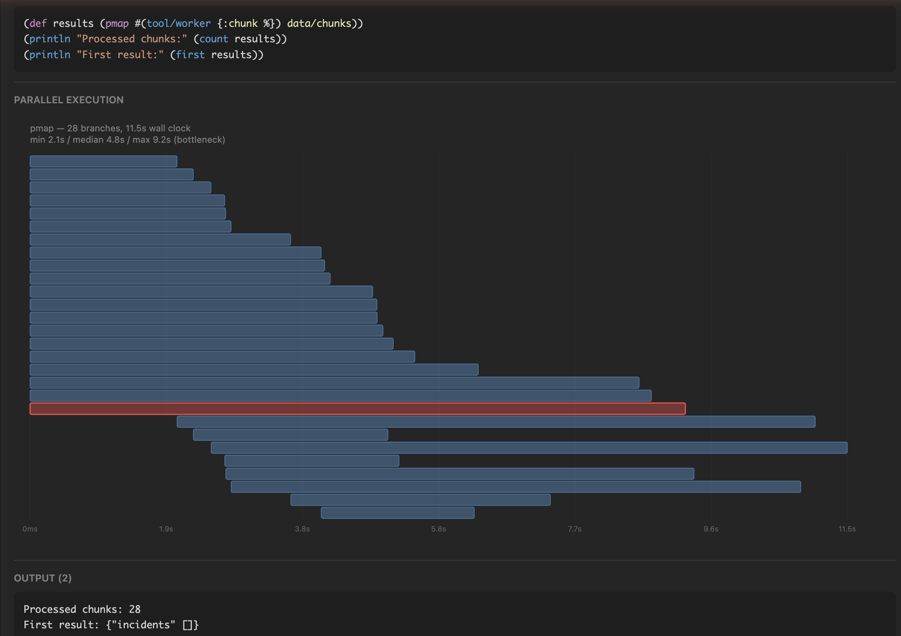

# Parallel Orchestration Example: LLM-Orchestrated Map-Reduce

Demonstrates an LLM acting as an **orchestrator** that dispatches work to parallel sub-agents and aggregates results. Inspired by the [RLM paper (arXiv:2512.24601)](https://arxiv.org/abs/2512.24601), but uses pre-chunking and single-level fan-out—no recursion.

> **For recursive decomposition**, see [`examples/rlm_recursive/`](../rlm_recursive/).

## Key Features

1. **Token-based chunking with overlap** - `Chunker.by_tokens` handles variable line lengths; overlap prevents boundary incidents (stack traces) from being split
2. **Simple worker agents** - Workers just analyze their chunk; no recursive subdivision needed
3. **Operator-level budget control** - `token_limit` and `on_budget_exceeded` options for cost control
4. **Configurable parallel timeout** - `pmap_timeout` allows LLM-backed tools to run longer than the default 5s

## Architecture

```
┌─────────────────────────────────────────────────────┐
│  Elixir (run.exs)                                   │
│  ┌─────────────────────────────────────────────────┐│
│  │ Chunker.by_tokens(corpus, 4000, overlap: 200)   ││
│  │   → [chunk1, chunk2, chunk3, ...]               ││
│  └─────────────────────────────────────────────────┘│
│                         │                           │
│                         ▼                           │
│  ┌─────────────────────────────────────────────────┐│
│  │ Planner (Sonnet)                                ││
│  │   data/chunks available as pre-chunked list     ││
│  │   pmap #(tool/worker {:chunk %}) data/chunks    ││
│  └─────────────────────────────────────────────────┘│
│           │         │         │         │           │
│           ▼         ▼         ▼         ▼           │
│  ┌───────────────────────────────────────────────┐  │
│  │  Workers (Haiku) - parallel processing        │  │
│  │  [analyze] [analyze] [analyze] [analyze]      │  │
│  └───────────────────────────────────────────────┘  │
│                         │                           │
│                         ▼                           │
│  ┌─────────────────────────────────────────────────┐│
│  │ Aggregated Results                              ││
│  │   {:total N, :incidents [...]}                  ││
│  └─────────────────────────────────────────────────┘│
└─────────────────────────────────────────────────────┘
```

## The Problem: Context Limitations

| Approach | Problem |
|----------|---------|
| Stuff everything in prompt | Attention dilution, cost explosion |
| Sequential chunk processing | Slow, loses cross-chunk patterns |
| RAG retrieval | Only sees "relevant" snippets |

## The Solution: Parallel Orchestration with PTC-Lisp

- **Context firewall**: Large data stays in `data/*`, never bloats the prompt
- **Native parallelism**: `pmap` spawns concurrent BEAM processes
- **Pre-chunking**: `PtcRunner.Chunker` handles chunking in Elixir
- **Budget control**: `token_limit` prevents runaway costs

## How to Run

### From parent project (recommended)

```bash
# Generate test corpus (10k lines with hidden incidents)
mix run examples/parallel_workers/gen_data.exs

# Run the parallel workers workflow
mix parallel_workers

# Run with hierarchical tracing
mix parallel_workers --trace

# View trace tree in terminal
mix parallel_workers --tree

# Export to Chrome DevTools format and open
mix parallel_workers --export --open

# Clean up all trace files
mix parallel_workers --clean
```

### Standalone (from examples/parallel_workers directory)

```bash
cd examples/parallel_workers
mix deps.get
mix run run.exs
mix run run.exs --trace
```

## Expected Output

```
Corpus: 5001 lines -> 28 chunks of ~4000 tokens (200 overlap)

=== Starting Parallel Orchestration (Sonnet -> Haiku) ===

=== Audit Complete ===
%{"total_incidents" => 17, "first_10_unique" => ["CRITICAL: Database connection timeout...", ...]}

+- Turn 1 ----------------------------------------+
| Program: (pmap #(tool/worker {:chunk %}) ...)  |
| Output: Total chunks processed: 28             |
+------------------------------------------------+
...
+- Usage -----------------------------------------+
|   Input tokens:  9,141                         |
|   Duration:      55,291ms                      |
|   Turns:         4                             |
+-------------------------------------------------+
```

## Discussion: Performance and Limitations

### Observed Performance

| Metric | Value |
|--------|-------|
| Corpus | 5001 lines → 28 chunks |
| Wall clock | ~55 seconds |
| Planner tokens | ~9K input, ~500 output |
| Planner turns | 4 |
| Workers | 28 parallel Haiku calls |

### Parallelism Effectiveness

Sequential processing of 28 Haiku calls at ~10-15s each would take **280-420 seconds**. The observed **~55 seconds** confirms a **5-8x speedup** from parallelism.

The PTC Trace Viewer renders a Gantt timeline showing the bounded concurrency — the first 20 workers start simultaneously (`schedulers_online() * 2`), with the remaining 8 starting as slots free up:



### Hierarchical Tracing

Use the `--trace` flag to capture detailed execution traces for the planner and every worker:

```bash
mix run examples/parallel_workers/run.exs --trace
```

This creates trace files in the gitignored `traces/` folder:
- `examples/parallel_workers/traces/parallel_workers_trace.jsonl` - Main planner trace
- `examples/parallel_workers/traces/trace_<id>.jsonl` - One per worker

The execution tree visualization shows duration and status for each:

```
=== Trace Summary ===
Main trace: examples/parallel_workers/traces/parallel_workers_trace.jsonl
Child traces: 28

Execution tree:
└─ [55291ms] [ok] (planner)
   ├─ [8500ms] [ok] (worker)
   ├─ [9200ms] [ok] (worker)
   ├─ [15000ms] [ok] (worker)  ← slowest chunk
   └─ ...
```

This reveals:
- **Individual worker durations** - identify "poison" chunks that are slow
- **Worker success/failure** - see which chunks failed without digging through logs
- **Parallelism effectiveness** - compare total wall clock vs. sum of worker times

### Viewing Trace Files

**Option 1: Chrome DevTools (Flame Chart)**

Export to Chrome Trace Event format using the mix task:

```bash
# Export to Chrome format
mix parallel_workers --export

# Export and auto-open in Chrome
mix parallel_workers --export --open
```

Then open in Chrome:
1. Open Chrome DevTools (F12) → **Performance** tab
2. Click **Load profile...** and select the `.json` file
3. Or navigate to `chrome://tracing` and load the file

**Option 2: Simple Browser Viewer**

Open `trace_viewer.html` in Chrome and drag & drop the `.jsonl` files:

```bash
open examples/parallel_workers/trace_viewer.html
# Then drag parallel_workers_trace.jsonl and all trace_*.jsonl files into the browser
```

**Option 3: IEx with Analyzer**

```elixir
alias PtcRunner.TraceLog.Analyzer

# Load and visualize the full tree
{:ok, tree} = Analyzer.load_tree("examples/parallel_workers/traces/parallel_workers_trace.jsonl")
Analyzer.print_tree(tree)

# View timeline for a specific trace
events = Analyzer.load("examples/parallel_workers/traces/parallel_workers_trace.jsonl")
Analyzer.print_timeline(events)

# Get summary statistics
Analyzer.summary(events)
```

**Option 3: Command line with jq**

```bash
# Pretty print all events
cat examples/parallel_workers/traces/parallel_workers_trace.jsonl | jq .

# Show just event types and durations
cat examples/parallel_workers/traces/parallel_workers_trace.jsonl | jq '{event, duration_ms}'

# Find slow workers (>10s)
cat examples/parallel_workers/traces/trace_*.jsonl | jq 'select(.duration_ms > 10000)'
```

**Cleanup**

```elixir
# Delete all trace files in the tree
{:ok, tree} = Analyzer.load_tree("examples/parallel_workers/traces/parallel_workers_trace.jsonl")
{:ok, count} = Analyzer.delete_tree(tree)
IO.puts("Deleted #{count} trace files")
```

### Relation to the RLM Paper

This example demonstrates the **mechanics** of RLM but not the full **adaptive intelligence** described in [arXiv:2512.24601](https://arxiv.org/abs/2512.24601):

| Paper Feature | This Example | Gap |
|---------------|--------------|-----|
| LLM-decided chunking | Pre-chunked in Elixir | Simpler, but less adaptive |
| Recursive subdivision | Single-level fan-out | No hierarchical decomposition |
| Budget-aware strategy | `token_limit` set | Planner doesn't use `(budget/remaining)` |
| Cross-chunk synthesis | Simple aggregation | No pattern detection across chunks |

### Possible Improvements

1. **Budget-aware batching**: Have the planner use `(budget/remaining)` to decide how many workers to spawn based on remaining token budget.

2. **Recursive workers**: Workers that can subdivide large chunks and call themselves, enabling hierarchical decomposition.

3. **Smarter aggregation**: Use Sonnet to synthesize patterns across worker results rather than simple concatenation.

4. **Adaptive chunk sizing**: Let the LLM decide chunk boundaries based on content (e.g., log session boundaries) rather than fixed token counts.

## See Also

- [RLM Patterns Guide](../../docs/guides/subagent-rlm-patterns.md) - Full documentation
- [`PtcRunner.Chunker`](../../lib/ptc_runner/chunker.ex) - Chunking utilities
