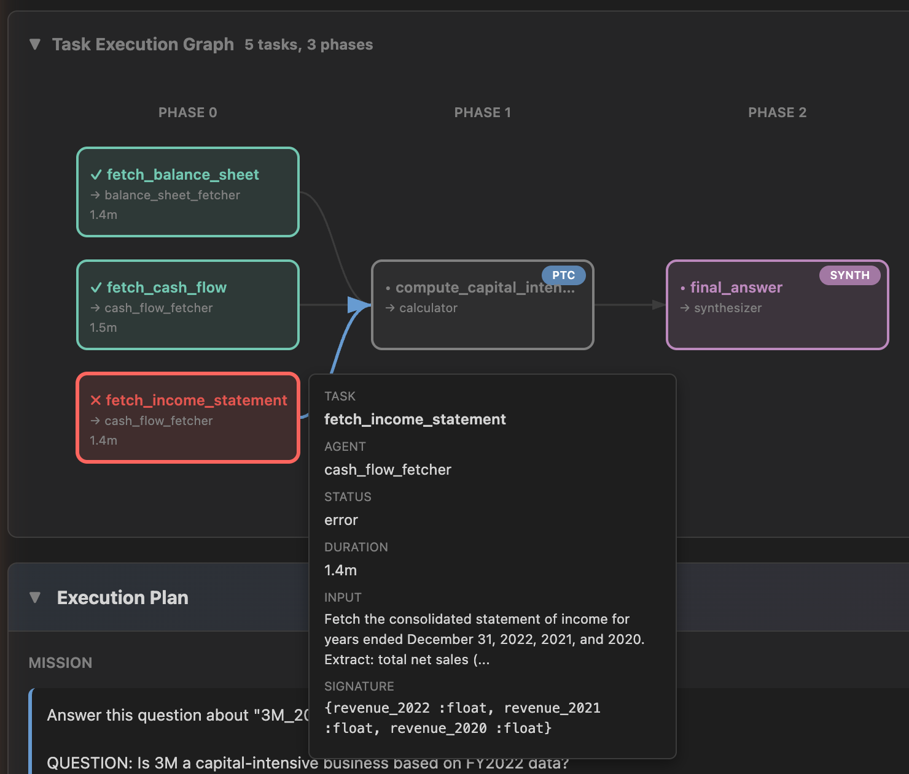
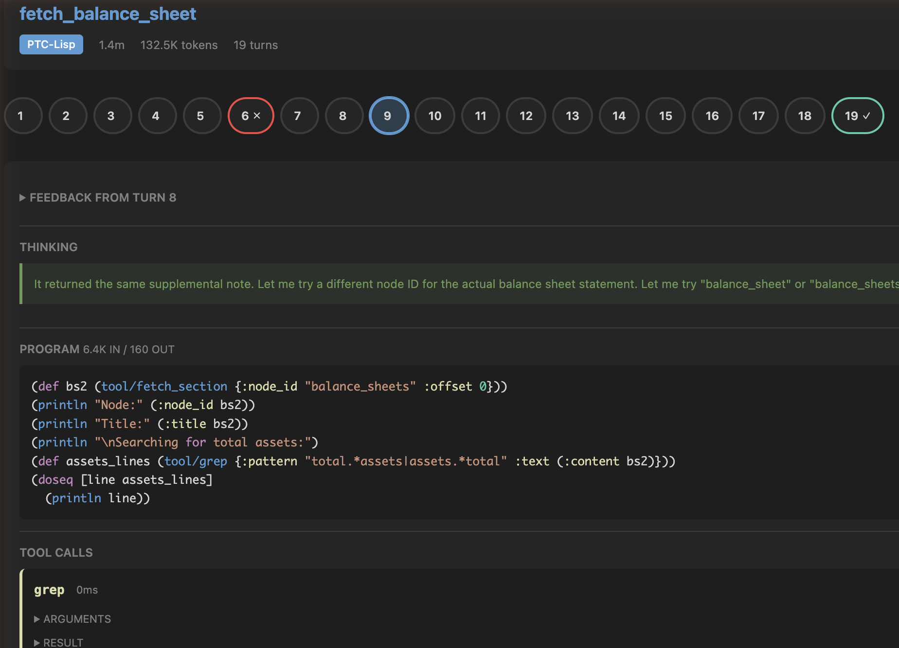

# PTC Trace Viewer

A web-based trace viewer for [PtcRunner](https://github.com/andreasronge/ptc_runner) execution traces. Visualizes LLM agent runs, multi-task execution plans, and parallel operations as interactive DAGs and turn-based timelines.

The meta planner decomposes a mission into parallel tasks, assigns each to a specialized agent, and orchestrates execution across phases. The viewer lets you inspect the full execution — from the high-level DAG down to individual agent turns.





## Quick Start

```bash
# From the ptc_runner root directory
mix ptc.viewer --trace-dir examples/page_index/traces --plan-dir examples/page_index/data
```

This starts a local web server (default port 4123) and opens the viewer in your browser.

## How It Works

PtcRunner's tracer emits `.jsonl` files containing timestamped events (LLM calls, tool executions, task start/stop, plan generation). The viewer parses these events and renders two levels of visualization:

### Overview (Plan Traces)

For traces containing `plan.generated` and `execution.start` events, the viewer shows:

- **Summary stats** — total duration, LLM calls, token usage (with in/out/cached breakdown), task count
- **Timeline** — horizontal bar showing LLM and tool execution segments proportional to duration
- **DAG graph** — D3-rendered directed acyclic graph of task dependencies, laid out by execution phase. Nodes are colored by status (green=ok, red=error, blue=running, gray=pending) and badged by output mode (PTC-Lisp/JSON/SYNTH). Supports replan tabs when the executor retries with a modified plan.
- **Plan card** — mission statement, agent definitions, and task list from the generated plan

### Agent View (Single-Agent Traces)

For individual agent traces, the viewer shows:

- **Agent header** — name, output mode, duration, token count
- **Turn lane** — horizontal row of clickable pills, one per LLM turn. Color indicates status (green=returned, red=error). Navigate with arrow keys.
- **Turn detail** — expandable sections for each turn: system prompt, thinking block, PTC-Lisp program (syntax-highlighted), tool calls with arguments/results, parallel execution fork-join diagrams, and final output

### Navigation

Breadcrumb-based drill-down: click a DAG node or child-agent tool call to navigate into that agent's trace. Press Escape to go back up.

## Usage

### Mix Task

```bash
mix ptc.viewer [options]
```

| Option | Default | Description |
|--------|---------|-------------|
| `--port` | 4123 | Port to listen on |
| `--trace-dir` | `traces` | Directory containing `.jsonl` trace files |
| `--plan-dir` | `data` | Directory containing `.json` plan files |
| `--no-open` | false | Don't auto-open browser |

### Programmatic

```elixir
{:ok, pid} = PtcViewer.start(
  port: 4123,
  trace_dir: "path/to/traces",
  plan_dir: "path/to/plans"
)

# Later...
PtcViewer.stop(pid)
```

### Drag-and-Drop

The viewer also works without a server. Open `index.html` directly and drag `.jsonl` files onto the drop zone. Load the main trace plus its child traces to see the full hierarchy.

## Architecture

```
Elixir (Plug + Bandit)          Browser (ES Modules + D3.js)
──────────────────────          ────────────────────────────
GET /api/traces      ──────>    app.js        (state, navigation)
GET /api/traces/:file ─────>    parser.js     (JSONL parsing, event pairing, DAG model)
GET /api/plans       ──────>    overview.js   (summary, timeline, plan card)
GET /api/plans/:file  ─────>    dag.js        (D3 SVG DAG rendering)
Plug.Static (/, css, js) ──>    agent-view.js (turn lane, turn detail)
                                fork-join.js  (D3 parallel execution diagram)
                                timeline.js   (horizontal timeline bar)
                                highlight.js  (PTC-Lisp syntax highlighting)
                                tooltip.js    (hover tooltips)
                                utils.js      (formatting helpers)
```

## API

| Endpoint | Description |
|----------|-------------|
| `GET /api/traces` | List `.jsonl` files with filename, size, modified date |
| `GET /api/traces/:filename` | Serve trace file content (NDJSON) |
| `GET /api/plans` | List `.json` files with filename, size, modified date |
| `GET /api/plans/:filename` | Serve plan file content (JSON) |

All file access uses `Path.basename/1` to prevent path traversal.
